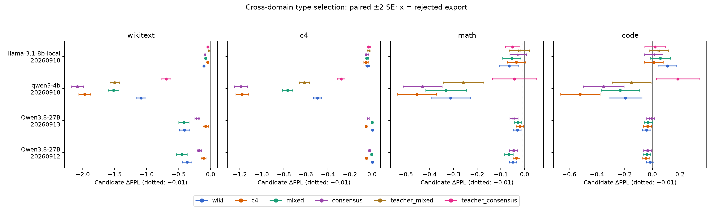

# Making MixFP4 Work Across Domains

**Motivation, method, experiments, and limitations**

September 7, 2026 · Experimental code and results: commit `5dc17ea`

MixFP4 gives a quantizer an additional choice: represent a block with E2M1 or
E0M3 while keeping its element width at four bits. The difficult part is choosing
where that flexibility helps the model. A format that reconstructs a weight
block more accurately need not improve the predictions of an already quantized
network. A selection that improves WikiText need not improve another domain.

Our strongest tested approach is **task-gradient selection on C4, followed by
actual-loss backtracking and independent validation**. The same algorithm
produced accepted maps on three models, with two calibration seeds for the
27B target. It reduced perplexity by at least **0.01 in 15 of 16 evaluated
model/seed/domain cases**. Fourteen cases had paired uncertainty intervals
supporting an improvement; no case had an interval supporting harm. The
remaining case, Llama code, was inconclusive rather than an established gain.

This is evidence for a useful common calibration procedure. It is not a
universal weight-statistic rule, a fixed map that can be reused across models,
or a guarantee for arbitrary domains. The experiments also identify clear
failures of Wiki-only selection and teacher-based selection on code.

## 1. Motivation: use four bits more effectively

At four bits, the placement of representable values matters. The two formats
used in this implementation have the following value sets before scaling:

| Format | Nonnegative values | Main distinction |
|---|---|---|
| E2M1 | 0, 0.5, 1, 1.5, 2, 3, 4, 6 | Nonuniform spacing, with smaller gaps near zero |
| E0M3 | 0, 1, 2, 3, 4, 5, 6, 7 | Uniform spacing |

Both also represent the negative values. Each has 15 distinct numerical values
in 16 codes because zero has redundant encodings. E0M3 here denotes the
implemented signed uniform grid; it does not mean that three mantissa bits
make every value more accurate than E2M1.

The tradeoff depends on scaling. With an ideal maximum-fitting scale, E2M1
places more resolution near zero, whereas E0M3 distributes resolution evenly
across the range. Real block scales are also quantized, so rounding those scales
can change which candidate is preferable. Different blocks can therefore
benefit from different grids.

The study uses two granularities:

| Quantity | Granularity |
|---|---|
| Element representation | Four bits |
| Block scale | One E4M3 scale per 16 elements |
| Format choice | One E0M3/E2M1 decision per 8×64 weight tile |
| Tensor normalization | Shared tensor-scale convention |

An 8×64 tile contains 512 weights and 32 scale groups. Its format choice is
shared by all those weights, while each 16-element group keeps its own scale.
This constrains the search to legal tile changes rather than independent
per-weight decisions. It also means that adding a format option does not
increase the element width. The experiments do **not** establish the packed
metadata cost or runtime speed of a production mixed-format kernel.

The practical objective is to improve accuracy at this fixed quantization
scope. A reduction of 0.01 absolute PPL already counts as worthwhile in this
project; a method need not produce a dramatic percentage gain to be useful.

## 2. Why a straightforward format election is insufficient

### Local reconstruction does not measure the full task

A natural selector compares the squared weight errors of the two candidates:

$$
\|Q_{E0M3}(W_b)-W_b\|_F^2
\quad\text{and}\quad
\|Q_{E2M1}(W_b)-W_b\|_F^2.
$$

This measures how well each candidate approximates the pristine weights.
It does not account for which inputs reach the block or how its outputs affect
the final prediction. Even at the linear-layer level, the output error is

$$
\mathbb E\|\Delta W x\|^2
=\operatorname{tr}(\Delta W\,\mathbb E[xx^T]\,\Delta W^T),
$$

which depends on the input second moment. Replacing weight error with output
error adds useful information, but still does not include the full downstream
loss or interactions with other quantized blocks.

The earlier mechanism experiments illustrate the distinction. High-energy
input columns identified a useful region of the target model, but randomizing
output-row groups within the selected regions lost much of the benefit.
The input location alone was not a sufficient selector. Separately useful
sets of corrections also did not combine additively. These observations
motivated a task-level selector rather than a universal channel-index rule.
See the [earlier mechanism findings](results/task_sensitivity_four_over_six/FINDINGS.md).

### Scale improvements must be separated from format improvements

MixFP4 can appear to help because its implementation searches more scales,
even when the additional E0M3 representation is not responsible for the gain.
We therefore used a strong fixed baseline and fixed candidate formulas:

- **E2M1 baseline:** FourOverSix, choosing between normalization toward code 6
  and code 4 independently in each scale group, using reconstruction error.
- **E0M3 alternative:** maximum-fitting normalization toward code 7, with
  alpha fixed at 1.
- **Selection experiment:** change only the tile's candidate representation;
  add no scale search, rotation, permutation, or weight training.

FourOverSix's two E2M1 normalizations correspond to alpha values 1 and 1.5
relative to normalization toward code 6. The candidates include the existing
E4M3 scale rounding and saturation behavior. Thus the final experiment asks
whether E0M3 can improve an already strong E2M1 baseline, not whether a weaker
baseline can be beaten by giving one branch extra scale optimization.

The implementation is in [quantizer.py](quantize/quantizer.py). Earlier scale
search results motivated this control; their numerical gains should not be
substituted for the type-selection results below.

## 3. The selection method

The central question is: **at the quantized model we will actually deploy,
which finite E0M3 substitutions are likely to improve task loss?**

Let $W^B$ denote the FourOverSix baseline and define the fixed candidate
change for tile $b$ as

$$
\Delta W_b=Q_{E0M3}(W_b)-W^B_b.
$$

For calibration sequence $i$, calculate

$$
s_{i,b}=\left\langle
\nabla_{W_b}\ell_i(W^B),\Delta W_b
\right\rangle.
$$

Here $\ell_i$ is mean next-token negative log-likelihood (NLL), in nats per
token. A negative score predicts that moving toward the E0M3 candidate reduces
loss. Crucially, the gradient is evaluated at the **quantized baseline**, not
the pristine model. It can identify corrections useful in the presence of the
baseline's existing errors.

The forward pass uses the actual fake-quantized weights and activations.
Backward propagation uses an identity straight-through estimator (STE) through
activation quantization. For a linear projection, its weight gradient is
formed from the actual quantized input $X$ and output adjoint $D$ as
$D^T X$, then reduced against $\Delta W_b$ per tile. Parameters remain
frozen: this collects sensitivity scores, not trained weights.

This is an approximate discrete-switch predictor. The STE does not make
activation rounding differentiable in the ordinary sense, and a full switch
can differ substantially from its first-order forecast.

### Stable scores and a bounded proposal

Across the fitting sequences, estimate the mean $\mu_b$ and standard error
$SE_b$. A tile is eligible only when

$$
\mu_b+2SE_b<0.
$$

Rank eligible tiles by their mean, most negative first. Starting with budget
$B=0.1$, take the largest ranked prefix satisfying

$$
-\sum_{b\in S}\mu_b\le B.
$$

The budget is in predicted NLL units rather than a fixed number or fraction of
tiles. This lets the same procedure select a different count on each model.
The budget limits extrapolation empirically; it is not an upper bound on the
actual loss change. The per-tile two-SE check is also a heuristic, not a
multiple-comparison certificate over millions of tiles.

### Backtracking on actual joint loss

We then install the **entire proposed map** and evaluate its fitting loss.
Let $\widehat\Delta=\sum_{b\in S}\mu_b$ be the predicted change, and let
$\bar d$ and $SE_d$ describe the measured paired per-sequence NLL change.
The fitting check requires

$$
\bar d+2SE_d<0,
\qquad
\frac{\bar d}{\widehat\Delta}\ge0.25.
$$

If either condition fails, halve the budget and construct a smaller prefix.
There are at most eight attempts, with budgets $0.1\times2^{-k}$ for
$k=0,\ldots,7$. If none succeeds, retain the baseline.

Backtracking was the decisive repair. In the first Qwen3.8 C4 run:

| Budget | E0M3 tiles | Predicted fitting ΔNLL | Measured fitting ΔNLL | Decision |
|---|---:|---:|---:|---|
| 0.1000 | 53,859 | -0.1000 | +0.09948 | Reject |
| 0.0500 | 12,202 | -0.0500 | +0.02287 | Reject |
| 0.0250 | 3,145 | -0.0250 | -0.00290 | Reject: only 11.6% of forecast |
| 0.0125 | 905 | -0.01250 | -0.00611 | Pass: 48.9% of forecast |

The second seed reproduced the initial wrong-direction prediction: predicted
-0.1, measured +0.09430. It also passed after shrinking the budget to 0.0125.
Because these failures occurred on the fitting domain itself, matching the
calibration domain alone could not solve the problem. The residual can include
STE error, finite-step curvature, and interactions; these experiments do not
uniquely assign the failure to one cause.

### Independent acceptance

After fitting selects one map, a separate validation set checks its actual
NLL change once. Acceptance requires validation mean plus two SE below zero.
A rejected map is preserved for analysis, but its export contains the baseline.
Validation does not choose the backtracking budget, and held-out evaluation
does not change the map or acceptance decision.

The recommended C4 variant uses 64 fitting windows and 16 independent
validation windows. Its operation can be summarized as:

```text
Construct the fixed FourOverSix baseline and E0M3 alternatives.
Collect task-gradient tile scores on 64 C4 fitting windows.
Keep tiles with mean + 2 SE < 0 and rank by predicted benefit.
For budget = 0.1, 0.05, ..., 0.00078125:
    Construct the prefix within the predicted-loss budget.
    Measure the combined map on fitting data.
    Stop when the paired improvement and prediction-ratio checks pass.
Validate that frozen map once on 16 separate C4 windows.
Export it if validation passes; otherwise export FourOverSix.
```

This avoids an exhaustive search over tile combinations, but it still needs
backward passes and a bounded number of joint forward evaluations. It is not
a calibration-free or purely analytical performance predictor.

## 4. Experimental design

The final domain study used native Transformers 5.16.1 implementations and
matched baselines for each model. It quantized the selected text linear weights
and their inputs to W4A4; the target's other native components, embeddings and
language-model head retained their existing behavior. The smaller-model panel
quantized non-head linear weights and inputs. Format decisions concerned
**weights**; activation quantization stayed fixed at FourOverSix throughout.

| Model | Calibration runs | Held-out Wiki windows | Held-out C4 documents | Math / code examples |
|---|---|---:|---:|---:|
| Qwen/Qwen3.8-27B | Seeds 20260912 and 20260913 | 127 | 256 | 128 / 128 |
| Qwen3-4B | Seed 20260918 | 128 | 256 | 128 / 128 |
| Llama-3.1-8B | Seed 20260918 | 123 | 256 | 128 / 128 |

Wiki calibration uses disjoint regions of the training split for fitting,
validation and diagnostic probes. Held-out Wiki uses the official raw
validation split. C4 calibration uses distinct training documents; each
qualifying document contributes one random 2,048-token window. Held-out C4
uses 256 documents from a separate validation shard, with recorded document
and token hashes. Calibration and evaluation C4 documents are hash-disjoint.

Math and code use GSM8K and MBPP reference text. They are **uncalibrated domain
stress tests of language-model loss**, not generated-answer accuracy, reasoning
success, or code pass@k. Their main metric weights examples equally; the raw
reports also contain token-weighted perplexity.

The two target seeds share held-out examples. Different model tokenizers change
Wiki window boundaries and can change which C4 documents satisfy the minimum
length condition. All policy comparisons are paired on identical examples
within a model. Native panel numbers must not be directly equated with older
results obtained using copied model implementations or different evaluation
splits.

We evaluated six selection variants:

| Rule | Fitting data / objective | Independent validation |
|---|---|---|
| Wiki | 64 Wiki windows, observed-token NLL | 16 Wiki windows |
| C4 | 64 C4 windows, observed-token NLL | 16 C4 windows |
| Mixed | 32 Wiki + 32 C4, pooled NLL scores and fitting loss | Pooled 8 + 8 windows |
| Consensus | 32 Wiki + 32 C4, stable negative scores and measured fitting improvement in each domain | Each 8-window domain separately |
| Teacher mixed | Same 32 + 32, teacher KL for scoring and fitting | Actual NLL on pooled 8 + 8 |
| Teacher consensus | Same 32 + 32, per-domain teacher-KL checks | Actual NLL in each domain |

Consensus ranks eligible tiles by their worst domain mean score. Its joint
fitting checks require a supported reduction and sufficient actual/predicted
agreement separately in both domains. A worst-domain score budget alone does
not bound the predicted change in every other domain.

Teacher variants were tested on the two smaller models, using cached logits
from their pristine, unquantized BF16 reference models. The fitting objective
was $KL(p_{teacher}\|q_{quantized})$. Validation still checked actual NLL,
so better imitation of the teacher could not override an NLL validation failure.
This follow-up was motivated by fitting-score diagnostics before new held-out
results were inspected.

The study contains 20 candidate maps and 80 candidate/domain evaluations.
All proposals and acceptance decisions were frozen before their held-out
evaluations. All heavy CPU work, GPU work, tests and numerical summaries ran
through Slurm on H100 allocations. No H200 or login-node heavy compute was used.

## 5. Results: what transfers

For these tables, **ΔPPL = candidate PPL − matched baseline PPL**. Negative is
better. An absolute reduction of 0.01 is practically meaningful. Statistical
support is reported separately through paired NLL mean ± two SE, transformed
to PPL units. Those intervals are descriptive, not simultaneous guarantees.

### C4 calibration gives the strongest overall coverage

All four C4 maps passed independent validation. Their held-out changes were:

| Model / seed | E0M3 tiles | Final budget | Wiki ΔPPL | C4 ΔPPL | Math ΔPPL | Code ΔPPL |
|---|---:|---:|---:|---:|---:|---:|
| Qwen3.8-27B / 20260912 | 905 | 0.0125 | -0.1094 | -0.0500 | -0.0343 | -0.0462 |
| Qwen3.8-27B / 20260913 | 864 | 0.0125 | -0.0775 | -0.0532 | -0.0199 | -0.0352 |
| Qwen3-4B / 20260918 | 125 | 0.1000 | -1.9695 | -1.1781 | -0.4542 | -0.5216 |
| Llama-3.1-8B / 20260918 | 2,924 | 0.0250 | -0.0452 | -0.0546 | -0.0342 | +0.0103 |

For scale, the target's Wiki baseline was 7.6890 PPL and its C4 baseline was
10.2257. The first C4 map changed these to 7.5796 and 10.1758. Qwen3-4B changed
from 15.2160 to 13.2465 on Wiki and from 17.8187 to 16.6406 on C4.

All eight target cells and all four Qwen3-4B cells have intervals supporting
improvement. On Llama, Wiki and C4 improvements are supported, while math and
code are inconclusive. The Llama code interval is [-0.0565, +0.0778] PPL:
the +0.0103 mean is not a verified gain, but neither is it confirmed harm.

The 15/16 count describes point improvements of at least 0.01 PPL, not 15
independent statistical confirmations. The final budget also varies by model;
0.0125 should not be substituted for adaptive backtracking as a universal
constant.

On the target, there are 47,559,680 candidate weight tiles. Selecting 905 and
864 corresponds to roughly 0.0019% and 0.0018% of them. Very sparse changes can
therefore give useful gains; maximizing the fraction of E0M3 tiles is not the
objective.

### Wiki-only gains do not establish domain transfer

The complete target comparison shows why Wiki performance alone was insufficient:

| Rule | Wiki ΔPPL, seed 1 / seed 2 | C4 ΔPPL, seed 1 / seed 2 | Maps accepted |
|---|---|---|---:|
| Wiki | -0.3684 / -0.4088 | +0.0028 / +0.0064 | 2/2 |
| C4 | -0.1094 / -0.0775 | -0.0500 / -0.0532 | 2/2 |
| Mixed | -0.4509 / -0.4183 | -0.0026 / +0.0004 | 2/2 |
| Consensus | -0.1781 / -0.2092 | -0.0209 / -0.0353 | 1/2 |

Both Wiki-only C4 changes are inconclusive and neither meets the 0.01 gain
criterion. Mixed calibration mainly strengthens Wiki: equal sample counts did
not produce meaningful C4 gains on this model. In seed one, mixed beats the
Wiki map by a paired -0.01133 ± 0.00232 NLL on Wiki, but its C4 contrast with
the Wiki map is inconclusive. Pooling can improve the aggregate objective
without improving the weaker domain.

Consensus produces useful candidate changes in both target domains, but the
second map failed validation: its favorable means were too uncertain in eight
windows per domain. Its later held-out gains belong to the **candidate**, not
the exported baseline. This distinction matters when comparing procedures.

### Broad comparisons and the code counterexamples

| Rule | Candidate cases with ≥0.01 PPL gain | Cases with supported improvement | Cases with supported harm | Accepted maps |
|---|---:|---:|---:|---:|
| Wiki | 13/16 | 12/16 | 1/16 | 4/4 |
| C4 | 15/16 | 14/16 | 0/16 | 4/4 |
| Mixed | 13/16 | 13/16 | 0/16 | 4/4 |
| Consensus | 15/16 | 13/16 | 0/16 | 2/4 |
| Teacher mixed | 7/8 | 6/8 | 0/8 | 1/2 |
| Teacher consensus | 6/8 | 5/8 | 1/8 | 2/2 |

Teacher rows cover only the two smaller models and are not a matched 16-case
comparison. Counts include rejected candidates; an exported fallback has zero
change from baseline, not the candidate's measured gain. Repeated target seeds
also share evaluation data.

No tested procedure established useful improvement everywhere. Two clear
counterexamples are particularly informative:

- The accepted Wiki map on Llama increased code PPL by **0.1078**, with an
  interval of [+0.0404, +0.1760], despite improving Wiki, C4 and math.
- Accepted teacher-consensus on Qwen3-4B increased code PPL by **0.1850**, with
  an interval of [+0.0298, +0.3426], despite passing Wiki/C4 validation.

These are measured failures on an uncalibrated domain. They rule out treating
Wiki/C4 acceptance, or teacher fidelity, as an automatic certificate for code.



## 6. What the diagnostics explain—and what they do not

### Useful selections depend on the calibration distribution

The target's Wiki and C4 maps shared only 10 tiles in seed one and 14 in seed
two, giving Jaccard overlaps near 0.009 and 0.012. However, the C4 maps improved
Wiki too. Low overlap therefore demonstrates different useful selections; it
does not prove that the domains require inherently conflicting optimal maps.

We also tested 15 selected tiles per target seed individually on reserved
eight-window probes in each domain. Point-sign agreement between forecast and
measurement was only about half, but almost all effects were inconclusive.
No probe established a stable wrong-sign effect. The small, deliberately
selected probe sample cannot estimate a global tile error rate or settle the
mechanism of domain conflict.

### Score alignment and noise differ across models

Using 64 fitting windows per domain, Wiki/C4 score-vector cosines were about
0.038 and 0.033 for the two target seeds, 0.795 for Qwen3-4B, and 0.276 for
Llama. Within-C4 split-half cosines were approximately 0.219, 0.961 and 0.204
for those model groups. Weak cross-domain alignment on the target coexists
with considerable within-domain sampling variability.

This helps explain why a single scalar summary of score disagreement cannot
decide whether a format change will generalize. It also makes the useful
four-domain transfer on Qwen3-4B less surprising, but it is an association,
not a causal proof or a new validated selector.

### Teacher KL did not provide a universal repair

For observed-token NLL, the logit gradient is $q-\mathrm{onehot}(y)$.
For teacher KL it is $q-p$. Removing the observed-token residual suggested
a hypothesis: teacher probabilities might provide a less noisy measure of
quantization damage.

The result was model-dependent. On Qwen3-4B at matched 32-window budgets,
cross-domain cosine fell from 0.775 for NLL to 0.350 for teacher KL. The C4
ratio $\sum SE_b^2/\sum\mu_b^2$ rose from 0.051 to 0.496. On Llama,
alignment improved and this noise-scale estimate decreased, but accuracy did
not become uniformly better. The ratio is descriptive, not a certified
fraction of noise. Together with the code regression, these measurements do
not support replacing actual-NLL selection with teacher KL as the default.

## 7. What “universal” can reasonably mean

The experiments support reusing the **procedure**: construct candidates at the
deployment baseline, estimate task sensitivity, limit the proposed change,
measure its actual effect, and validate independently. They do not support
reusing the same tile identities, a fixed tile quota, or one final budget.

An unconditional improvement for every possible text/label distribution is
also too strong a requirement. If two normalized next-token distributions
differ, at least one token has lower probability under the changed model.
A distribution concentrated on that context and token would have worse log
loss. This does not prevent broad practical gains on real workloads; it
clarifies why evidence must refer to specified domains.

If a fixed map's **true expected NLL change** is nonpositive separately in
each declared domain, its change is nonpositive on any fixed mixture of those
domains by linearity of expectation. Our finite-sample two-SE checks do not
prove that premise, and the identity does not cover a new domain outside the
mixture. The [guarantee analysis](results/task_sensitivity_four_over_six/GUARANTEE.md)
discusses the assumptions needed for stronger certification.

## 8. Implementation, validation, and reproducibility

The final experiment uses fake quantization to evaluate accuracy with native
model behavior. It does not benchmark a packed mixed-format inference kernel,
latency, memory bandwidth, long-context generation, or task decoding accuracy.
Small perplexity gains should not be converted into throughput or reasoning
claims.

Model revisions, dataset revisions, token fingerprints, quantized module
shapes, maps, validation decisions, and per-example losses are recorded in
the raw reports. Native baseline checks reproduced the required reference
losses. Structural tests covered moment pooling, consensus eligibility and
fallback behavior; teacher-loss checks covered its gradient and normalization.
All summary calculations and plot generation completed on Slurm allocations.

An attempted scoring placement optimization was rejected by an exact score
comparison and disabled. The reported experiments use the original scoring
backend. Intermediate failures are documented rather than mixed into the
final numerical results.

| Artifact | Purpose |
|---|---|
| [Final numerical report](results/task_sensitivity_domains/REPORT.md) | All 80 candidate/domain cells, intervals, contrasts and acceptance decisions |
| [Summary CSV](results/task_sensitivity_domains/summary.csv) | Absolute and relative PPL changes, uncertainty and the 0.01 criterion |
| [Hypotheses](results/task_sensitivity_domains/HYPOTHESES.md) | Motivation and competing explanations declared during experiment design |
| [Execution notes](results/task_sensitivity_domains/RUN_NOTES.md) | Provenance checks, unsuccessful setup attempts and scheduling changes |
| [Target runner](run_domain_sensitivity.py) | Two-seed calibration, finite-step checks and held-out evaluation |
| [Model panel](run_domain_panel.py) | Matched native model transfer experiments |
| [Teacher follow-up](run_domain_teacher.py) | Teacher-KL hypotheses with actual-NLL validation |
| [Summary generator](summarize_domain_sensitivity.py) | Paired tables, CSVs and figure |

The accepted C4 type maps are under `results/task_sensitivity_domains/`:
`seed20260912/c4_export.json`, `seed20260913/c4_export.json`,
`panel/qwen3-4b/c4_export.json`, and
`panel/llama-3.1-8b-local/c4_export.json`. They must be applied to the same
pristine source weights, with the recorded activation configuration and the
appropriate native or generic map loader. Rejected candidates are retained
separately for analysis. Large score checkpoints are gitignored; the committed
JSON reports and scripts preserve the experimental record and regeneration
procedure.

## 9. Practical conclusion and next experiments

For the tested setting, C4 task-gradient selection with backtracking is the
best starting point when broad transfer and acceptance rate matter. It is not
the winner on every individual metric: mixed calibration yields larger target
Wiki gains, and consensus can be stronger on Qwen3-4B. The common improvement
over a raw selector is to respect the actual quantized baseline and verify
the combined finite change.

The next unresolved problem is reliable coverage of domains such as code.
A useful follow-up would add code to independently split calibration and
validation data, preserve fresh held-out tests, and size validation to resolve
0.01 PPL differences. Larger validation budgets may also reduce the rejection
of useful consensus candidates. These are proposed experiments, not fixes
already established by this study.

MixFP4 works here because a small number of carefully selected E0M3 switches
can improve the quantized network's task loss. The evidence favors **adaptive,
measured selection** over choosing a format from weight shape alone or assuming
that gains on one dataset will carry over everywhere.
