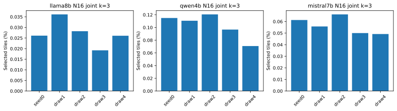
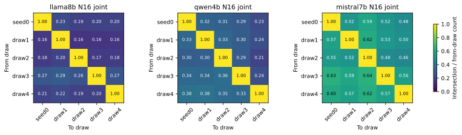
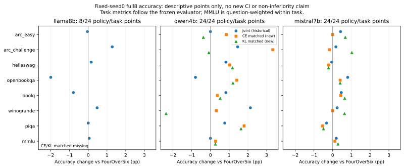
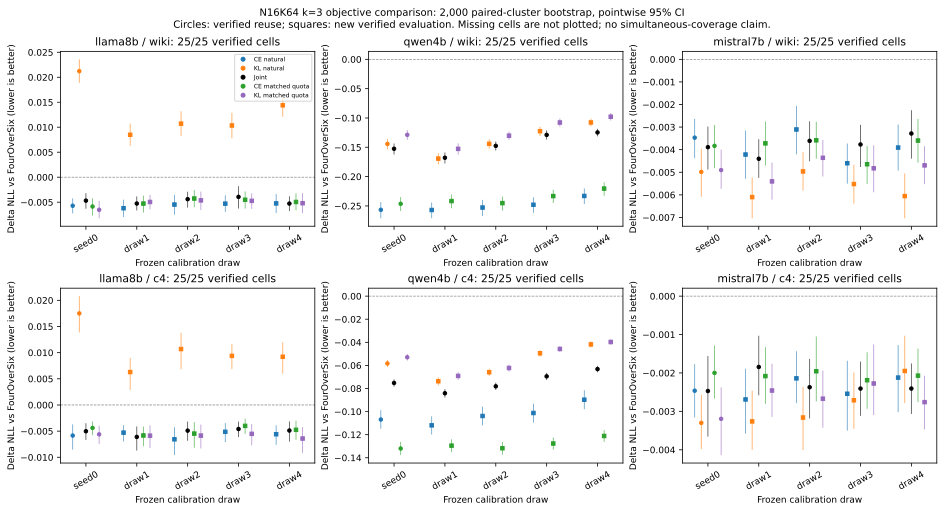
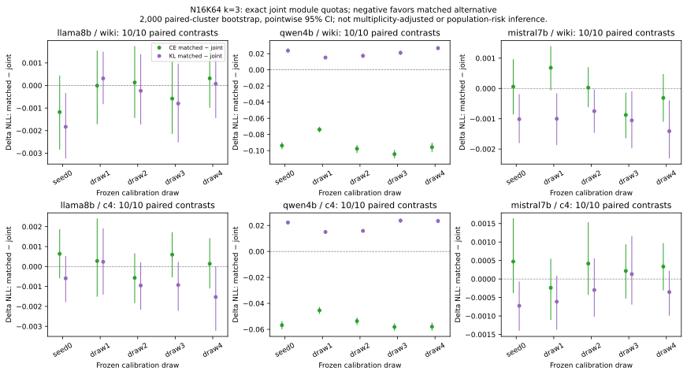
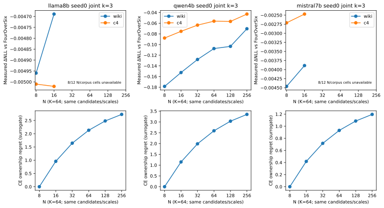

# Selector characterization — interim verified results

Operational update, 2026-09-23: the user authorized one additional repair each
for Llama/Mistral calibration and Qwen coarse-granularity evaluation. Mistral's
fourth calibration attempt completed operationally but failed exact score/map
identity, as did Llama's; both parent sets are rejected. Qwen evaluation
completed under the same three-GPU cap and passed full admission: eight new
coarse cells and exact N8/N16 reproduction on both corpora.
Earlier exhausted-budget descriptions
remain historical. Llama secondary accuracy is outside this grant and remains
blocked. See `results/ADDITIONAL_RETRY_PLAN.json`; no scientific gate changed.

This campaign is **not fully complete**. T1 CPU characterization and the bounded
T4 review and T2's primary PPL panel are complete. Secondary accuracy and
T3 still lack new evaluations. Do not
read generated maps or analytical surrogates as measured quality results.

Workspace base HEAD: `db63419cc33b2bbbda2117aad636435a2956532d`.
New scripts are uncommitted hash-identified artifacts; historical outcomes
retain their own per-run source manifests, not this HEAD as their generator.
The handoff ZIP is independently hash-verified; its prior numerical excerpts
are not used as fresh measurements. Exact revisions, token hashes, candidates,
score estimator and all 15 calibration identities are in
[FROZEN_PROTOCOL.yaml](FROZEN_PROTOCOL.yaml).

## Main findings so far

The [per-model objective tables](results/OBJECTIVE_TABLES.md) show available
draw counts, means, sample SDs, observed worst points and regression counts.
Their delta NLL points are independently recomputed from paired cluster arrays;
incomplete panels are not treated as complete five-draw summaries.

1. Sparse natural joint maps change across draws, but overlap far more than
   module-preserving random selections. Low Jaccard alone is not random selection.
2. Fixed module quotas increase measured pairwise overlap but do not establish
   identical ranking. Ten pairs share five maps; they are not ten independent
   experiments. High module rank correlation also need not mean equal shares.
3. All 30 existing joint model/draw/corpus ΔNLL points are favorable. This is
   observed quality variation, not a population tail-risk guarantee or evidence
   that every accuracy endpoint improves.
4. Qwen's now-complete five-draw panel has more favorable CE-matched than
   joint NLL points on all ten draw/corpus endpoints, and smaller observed
   across-draw SD. KL-matched is less favorable than joint at all ten points.
   Llama and Mistral panels are also complete. Neither
   universal conjunction superiority nor population risk is established.
5. Qwen's exact parent-score construction increases selected **weight fraction**
   from 0.1036% at N8 to 0.1664% at N256. Coarser ownership therefore does not
   necessarily mean fewer selected weights. Its ownership regret increases
   while threshold/veto surrogate increments decrease; none is measured NLL.
6. Sampled individual CE signs are near chance and rank correlations weak or
   negative on two models. This does not negate separately measured group
   effects, nor establish that accumulation uniquely explains them.

## T1: quantity, identity, and ranking

| Model | Selected count, five draws | Common core | Union | Natural pair Jaccard range | Fixed-module-quota Jaccard range |
|---|---|---:|---:|---:|---:|
| Llama-3.1-8B | 1781, 2463, 1923, 1309, 1777 | 221 | 7375 | 0.0960–0.1298 | 0.1694–0.2068 |
| Qwen3-4B | 4077, 3925, 4278, 3433, 2512 | 439 | 11966 | 0.1493–0.1924 | 0.2112–0.2626 |
| Mistral-7B-v0.3 | 4179, 3800, 4508, 3411, 3355 | 1401 | 9047 | 0.3627–0.3986 | 0.4329–0.5004 |

Counts refer to N16K64 format blocks, not 1×16 scale blocks. Universes are
6,815,744 / 3,548,160 / 6,815,744 blocks respectively and agree across draws.
Minimum module quotas retain 1001 / 2082 / 2946 blocks; 66/224, 79/252 and
131/224 modules have zero quota. The corresponding full output tables include
directional containment, empty flags, cutoff ties, frequency 0–5, module-share
L1 distance, and all five predeclared global-budget sensitivities.

The null is 1,000 exact hypergeometric module-wise intersection draws, seed
20260922. Its percentile envelope describes random map identity, **not** a
calibration-draw confidence interval. Expected intersections use
`sum(K_a,module * K_b,module / U_module)`; no ratio of expectations is called
the exact expected Jaccard.

Explicit five-draw count and density mean, sample SD, min/max and range for
every module and model are in `results/map_count_summary.csv`. These describe
how many tiles are selected; they do not establish identity or ranking stability.

## T2: actual quality coverage and uncertainty

The 75 maps are hash-frozen. Of 150 logical model/draw/policy/corpus cells,
54 have validated historical reuse and 96 have validated new evaluations;
none of the primary PPL cells remain missing. Reuse includes
all five policies on seed0 and joint on the other four draws. Six baseline
rows are separate. Same-mask reuse retains logical draw/policy identities.

The first new full run, Mistral draw1, passes the complete baseline-window,
runtime, map, and raw-array ingestion checks. Its KL-matched ΔNLL is
−0.005404 (Wiki) and −0.002457 (C4), versus joint −0.004403 and −0.001844.
These point estimates provide another counterexample to universal joint
superiority, not a five-draw risk conclusion. All four new policies and their
pointwise intervals are retained in `results/quality_results.csv`; no arm was
selected for reporting or continuation by its outcome.

Llama draw1 also passed the full-window ingestion gates. KL-only natural
regresses against FourOverSix: ΔNLL +0.008487 (Wiki) and +0.006283 (C4),
whereas the frozen joint map gives −0.005270 and −0.006104. KL matched-quota
gives −0.004957 and −0.005867. This is an observed draw-specific difference,
not a population robustness guarantee or an isolated causal explanation of
the veto. Natural and matched-quota maps answer different questions; the
reported intervals remain pointwise exploratory, not multiplicity-adjusted.

Mistral draw2 passed the same full-window gates. KL matched-quota ΔNLL is
−0.004360 (Wiki) and −0.002670 (C4), compared with joint −0.003610 and
−0.002372. All eight new non-joint policy/corpus points are favorable against
FourOverSix on this draw. This does not erase Llama's natural-KL regressions,
establish universal KL superiority, or complete the five-draw comparison.

Qwen draw1 also passed full-window validation. CE matched-quota gives ΔNLL
−0.241708 (Wiki) and −0.129528 (C4), versus joint −0.167815 and −0.084134;
KL matched-quota gives −0.152637 and −0.069121. These draw-specific points
reinforce objective dependence, not universal CE dominance. Natural-rule
outcomes and all paired pointwise intervals remain separately tabulated.

Mistral draw3 passed the full-window gates. KL matched-quota gives ΔNLL
−0.004825 (Wiki) and −0.002274 (C4), versus joint −0.003770 and −0.002407.
Thus the matched-versus-joint point-estimate direction differs by corpus
even within this draw. All eight new policy/corpus points remain favorable
against FourOverSix, but this is not evidence of universal objective dominance.

Qwen draw2 also passed full-window validation. CE matched-quota ΔNLL is
−0.245167 (Wiki) and −0.131770 (C4), versus joint −0.147555 and −0.078123;
KL matched-quota is −0.130185 and −0.062261. All eight new points improve
on FourOverSix, while objective identity still matters within fixed quotas.
These observations remain per-draw, pointwise exploratory comparisons.

Qwen draw4's retry passed full-window validation after its invalid first
attempt was excluded. CE matched-quota gives ΔNLL −0.220412 (Wiki) and
−0.121146 (C4), versus joint −0.124670 and −0.063191. KL matched-quota gives
−0.097847 and −0.039733. All eight new policy/corpus points are favorable
against FourOverSix; CE-matched is more favorable than joint on these two
points and KL-matched less favorable. This is not a population dominance
claim. Qwen draw3 has now passed the same gates; its full-panel summary is
below. Full values and pointwise cluster
intervals, including natural-rule results, are retained in the tidy tables.

Llama draw2 passed full-window validation. KL-natural again regresses:
ΔNLL +0.010713 (Wiki) and +0.010687 (C4), versus joint −0.004398 and
−0.004903. KL matched-quota instead gives −0.004636 and −0.005855.
The natural-versus-matched distinction is therefore material in another
observed draw; it does not by itself identify density as the sole causal
mechanism or estimate population tail risk from five draws.

Llama draw3 also passed full-window validation: natural KL gives ΔNLL
+0.010345 (Wiki) and +0.009386 (C4), versus joint −0.003933 and −0.004593.
KL matched-quota gives −0.004734 and −0.005520. CE matched-quota gives
−0.004517 and −0.003998, so its point-estimate comparison with joint changes
direction across corpora. Preserve these objective/context differences;
they are exploratory observed effects, not population robustness guarantees.

### Completed Qwen five-draw panel

Each entry is mean ΔNLL versus FourOverSix ± **observed across-draw sample SD**
(five calibration draws), not a confidence interval. Natural rules have their
own selected counts; matched rules use each draw's exact joint module quotas.

| Qwen policy | Wiki mean ± SD | C4 mean ± SD | Observed positive ΔNLL points |
|---|---:|---:|---:|
| CE natural | −0.249439 ± 0.009894 | −0.102725 ± 0.008277 | 0/10 |
| KL natural | −0.137575 ± 0.023514 | −0.057864 ± 0.012708 | 0/10 |
| Joint natural / quota reference | −0.144283 ± 0.017708 | −0.074033 ± 0.008037 | 0/10 |
| CE matched-quota | −0.237355 ± 0.010777 | −0.128428 ± 0.004440 | 0/10 |
| KL matched-quota | −0.123433 ± 0.021371 | −0.053965 ± 0.011932 | 0/10 |

Sources: `results/draw_variation.csv`, `model=qwen4b`, all policies have
`draws_available=5` and `coverage_complete=True`; the paired contrasts and
pointwise cluster intervals are in `results/quality_contrasts.csv`. Across all
ten draw/corpus points, CE-matched-minus-joint ranges from −0.104315 to
−0.045393; KL-matched-minus-joint ranges from +0.015013 to +0.026823. These
corpora and draws are not ten independent replications. Zero observed
regressions and smaller observed SD do not establish population tail risk,
universal CE superiority or accuracy preservation. Llama/Mistral panels
still lack draw4 at this checkpoint.

| Model | Joint Wiki ΔNLL mean ± across-draw SD | Joint C4 ΔNLL mean ± SD | Observed regressions |
|---|---:|---:|---:|
| Llama | −0.004713 ± 0.000578 | −0.005101 ± 0.000582 | 0/10 |
| Qwen | −0.144283 ± 0.017708 | −0.074033 ± 0.008037 | 0/10 |
| Mistral | −0.003791 ± 0.000410 | −0.002300 ± 0.000257 | 0/10 |

NLL is token-weighted; ΔNLL is delta-log-PPL, and relative PPL change is
`exp(ΔNLL)-1`. Paired cluster arrays and 2,000 shared-resample pointwise
bootstrap intervals are included. C4 units are document hashes; Wiki inherits
the historical first-article assignment for mixed windows, not a claim that
every scored token has been resegmented into a single article. Five draws
and two corpora are not independent model-family replications.

Veto tables distinguish opposing mean, favorable mean failing the 3-SE
threshold, and neutral cases. KL threshold failure is not synonymous with
predicted harm. CE–KL dependence is retained; no independence assumption or
simultaneous-confidence claim is made.

Secondary full-eight-task coverage is **80/96** cells: baseline/joint on all
three models plus newly admitted Qwen/Mistral CE/KL matched maps. Llama's 16
matched-policy cells remain missing. `results/ACCURACY_SAMPLE_AUDIT.json` checks historical
raw gzip/content hashes, per-question prompt/target identities, runtime
compatibility and all 48 reported means, including question-weighted MMLU.
The 24 paired model/task arrays are in `results/accuracy_arrays/`; no new
accuracy intervals or safety claim are inferred by this audit.

| Model, fixed seed0 joint | Eight-task macro accuracy change vs FourOverSix (percentage points) | Tasks with negative point change |
|---|---:|---:|
| Llama | −0.1093 | 3/8 |
| Qwen | +0.6494 | 1/8 |
| Mistral | +0.2379 | 2/8 |

These are equal-task macro point changes from
`results/accuracy_sample_metrics.csv`, not new confidence-interval or
non-inferiority conclusions. Within MMLU, questions are weighted as in the
frozen evaluator. This seed0 audit is not five-draw accuracy robustness.

Qwen's guarded attempt2 passed exact baseline responses, prompts/correctness,
runtime, source, map and ownership-cadence gates; all 16 new task cells are
admitted in `results/ACCURACY_NEW_AUDIT.json`. The
[array-checked full8 table](results/SECONDARY_ACCURACY_TABLE.md) gives CE-matched
macro accuracy 65.4314% (+1.1689 pp versus baseline) and KL-matched 64.5073%
(+0.2448 pp). CE-matched has no negative task point changes; KL-matched has
three, including Winogrande −2.3678 pp. Joint's historical macro is 64.9119%.

Mistral's guarded attempt2 also passed all admission gates. CE matched has
macro accuracy 68.7988% (+0.0032 pp versus baseline) with 3/8 negative task
changes; KL matched has 69.1640% (+0.3684 pp) with 2/8 negative changes.
Historical joint has 69.0335% (+0.2379 pp). The near-zero CE macro point is
not equivalence or non-inferiority, and the positive KL macro does not imply
every task improved. Exact paired arrays and all task points remain available;
no new CI or significance claim is made for these fixed-seed0 observations.
These are fixed-seed0 descriptive points, not new significance, non-inferiority
or five-draw accuracy-robustness claims. Paired binary correctness arrays are
preserved in `results/accuracy_new_arrays/` and independently rechecked by
`scripts/accuracy_table.py`.

The following intervals are for the paired matched-minus-joint contrast itself,
not inferred from overlap of the baseline-relative intervals above. Negative
values favor the matched alternative. These are pointwise exploratory intervals,
not multiplicity-adjusted tests or a population cross-draw risk estimate.

### Completed Llama five-draw panel

Llama draw4 passed postflight, all ownership checks and full-window ingestion.
The complete five-draw results below are mean delta NLL ± sample SD, not CI.

| Policy | Wiki | C4 | Observed regressions / 10 |
|---|---:|---:|---:|
| CE natural | −0.005586 ± 0.000394 | −0.005684 ± 0.000564 | 0/10 |
| KL natural | +0.013030 ± 0.005053 | +0.010613 ± 0.004172 | 10/10 |
| Joint natural / quota reference | −0.004713 ± 0.000578 | −0.005101 ± 0.000582 | 0/10 |
| CE matched-quota | −0.004978 ± 0.000633 | −0.004886 ± 0.000756 | 0/10 |
| KL matched-quota | −0.005210 ± 0.000765 | −0.005855 ± 0.000348 | 0/10 |

Natural KL and KL matched-quota differ in both budget and selected identities;
their contrast does not uniquely isolate density as the cause. On draw4,
CE-matched is less favorable than joint on both corpora, and KL-matched is
less favorable on Wiki but more favorable on C4. These model/corpus-dependent
point results and five observed draws do not establish population tail risk.
Exact values and pointwise intervals remain in `quality_results.csv` and
`quality_contrasts.csv`; the paired-array point recomputation is recorded in
`results/OBJECTIVE_TABLE_AUDIT.json`.

### Completed Mistral panel and cross-model counterexamples

Mistral draw4's final permitted repair passed postflight and full ingestion.
All 50 Mistral policy/draw/corpus points are favorable versus FourOverSix.
Mean delta NLL ± sample SD over five calibration draws (not CI):

| Policy | Wiki | C4 | Observed regressions / 10 |
|---|---:|---:|---:|
| CE natural | −0.003859 ± 0.000592 | −0.002391 ± 0.000251 | 0/10 |
| KL natural | −0.005524 ± 0.000553 | −0.002876 ± 0.000569 | 0/10 |
| Joint natural / quota reference | −0.003791 ± 0.000410 | −0.002300 ± 0.000257 | 0/10 |
| CE matched-quota | −0.003875 ± 0.000442 | −0.002059 ± 0.000089 | 0/10 |
| KL matched-quota | −0.004838 ± 0.000379 | −0.002671 ± 0.000348 | 0/10 |

Across all 150 primary cells there are 140 favorable and 10 unfavorable
baseline-relative points; all ten unfavorable points are Llama KL-natural.
Matched alternatives are more favorable than joint on these observed points:

| Model | CE matched / 10 | KL matched / 10 |
|---|---:|---:|
| Llama | 4/10 | 7/10 |
| Qwen | 10/10 | 0/10 |
| Mistral | 3/10 | 9/10 |

These counts are descriptive, not ten independent trials or corrected tests.
They reject universal joint pointwise dominance, not establish a universally
best replacement objective. All 150 delta NLL points were independently
recomputed from paired cluster arrays. The primary PPL controller exited
normally; the 16 missing Llama secondary matched-policy accuracy task cells remain
explicitly pending, not filled by PPL results.

## T3: exact aggregation versus actual quality

All three models have verified stored N8/N16 moments. Qwen also has a verified
full 128-sequence N8 score shard, enabling exact parent covariance and maps
at N32/64/128/256. Llama/Mistral do not: their marginal moments cannot recover
cross-child covariance. Eight parent map definitions remain blocked pending
verified exact raw scores or anchored calibration regeneration. Their initial
repair limits were exhausted. On 2026-09-23 the user explicitly granted one
additional Llama calibration, Mistral calibration and Qwen coarse evaluation
attempt each; these named jobs are now running/waiting, not accepted results.
No covariance is set to zero and no fifth attempt is authorized.

The authorized Mistral repair restored the historical quant-source hash and
original raw/subset options, and completed with valid GPU monitoring in
0.174001 A6000 GPU-hours. All 128 CE and KL forward losses and teacher losses
match, as do tokens/candidates/module identities. Nevertheless only 6/224
score-stream digests match; the N8/N16 masks differ by 58/34 tiles. The high
Jaccard values (0.9923/0.9919) do not satisfy exact identity. No regenerated
parents were admitted. Source/storage restoration was insufficient; the
backward discrepancy's cause remains unresolved, not proved to be hardware
or nondeterminism. See `results/AUTHORIZED_CALIBRATION_AUDIT.json`.

Llama's authorized repair likewise completed operationally (0.188151 A6000
GPU-hours), with all 128 CE/KL forward losses and teacher losses matching,
but only 6/224 score streams matching. Its N8/N16 masks differ by 71/39 tiles
(Jaccard 0.9775/0.9784). Neither this result nor Mistral's permits accepting
new parent covariance. Both additional attempts are consumed; no fifth run
is authorized. Verified historical full scores/covariance or an independently
resolved historical-reproduction discrepancy are still needed for those
16 coarse model/N/corpus cells. Qwen has verified original raw scores and
is a separate still-running evaluation, not affected by this rejection.

The [array-checked measured table](results/GRANULARITY_TABLE.md) has 20/36
model/N/corpus cells: 12 historical N8/N16 cells and eight new Qwen coarse cells.
The other 16 Llama/Mistral cells are explicitly missing. Qwen WikiText delta NLL
progresses from -0.178481 at N8 to -0.070405 at N256; C4 from -0.087784 to
-0.042871. All six Qwen points remain below FourOverSix. C4 is not strictly
monotonic: N128 (-0.056648) is slightly better than N64 (-0.056167), a point
comparison without an adjacent-contrast significance claim. N256 retains
39.45%/48.84% of N8's delta-NLL improvement on WikiText/C4. This is neither
accuracy retention nor a three-model coarse-granularity conclusion.
Table points are independently recomputed from six paired-array files;
pointwise intervals retain the frozen 2,000 natural-cluster bootstrap draws.
A separate surrogate table contains
ownership/threshold/veto decompositions; its sums cannot substitute for whole
model NLL. Scale blocks remain 1×16; candidate values and scales are not refit.
The new N maps are software-emulation definitions, not native hardware support.

## T4: bounded mechanism evidence

[Individual review](individual_tile_review.md) and all 480 sampled-tile
records retain sampling strata, finite effects and sequence SEs. Same-data
prediction/effect comparisons, numerical precision, mixed batch-size restore
checks, and limits of the noise controls are disclosed. Group intervention
outputs are genuine simultaneous switches, not sums mislabeled as observations.

Comparisons of Math64/Code64 against mixed128 confound budget; existing mixed64
also provides an equal-budget, shared-prefix descriptive contrast, but not a
five-draw composition factorial (see `results/composition_existing.csv`). Falcon/Granite
belong to the post-hoc extension, not additional primary confirmations. Later
reordering uses a different setup; its unmet 90% target and failed transfer
gates remain negative evidence. Retention and incremental recovery are distinct.
The bounded [ratio audit](results/reorder_ratio_audit.csv) recomputes this
distinction: historical Qwen27B PPL retention is 43.20%/54.62%, whereas
incremental recovery from its local raw coarse map is 20.30%/33.23%. These
are separate tensor-wide-activation results, not additions to the T3 curve.

## Execution gate and remaining work

The chronological execution notes below preserve superseded queue states.
Current terminal state: all three additional authorized attempts have ended;
Qwen is accepted, both calibration parent sets rejected. No GPU job remains.
T2 primary PPL is 150/150, secondary accuracy 80/96, T3 quality 20/36.
Only external data/identity resolution and separately authorized missing work
can unblock the remaining cells; this is not a full handoff acceptance.

Two exclusive Ada pilot attempts completed without recorded co-tenancy and
consumed 0.118850 GPU-hours. Identical weight/token hashes did **not** yield
historical A6000 NLL: maximum per-window difference was 0.0233921. Repeating
with historical teacher/thread settings produced identical Ada results. This
does not resolve hardware versus source/runtime causes. The frozen tolerance
is unchanged. The A6000 replacement pilot (attempt4) subsequently completed
and reproduced every tested baseline/N16 window exactly (maximum delta NLL
0). This passes the Llama prefix anchor, not the full-window ingestion gate.
It supports retaining A6000 for historical comparisons, without proving that
architecture alone caused the Ada discrepancy.

The first A6000 launch (attempt3) was invalidated when a foreign process
appeared after preflight. Its 0.007020 GPU-hours are retained in accounting;
its partial outputs are excluded. Attempt4 consumed 0.059973 GPU-hours.
Mistral attempt1 failed before model loading because the configured hub lacked
its pinned snapshot (0.002469 GPU-hours). Terminal attempts total 0.188312
GPU-hours before the recovered-cache Mistral pilot; running jobs are excluded
from terminal accounting. Mistral attempt2 subsequently passed the same prefix
anchor with maximum delta NLL 0 (0.044091 GPU-hours), bringing terminal cost
to 0.232402 GPU-hours. Qwen attempt2 also passed exactly (0.033318 GPU-hours),
bringing terminal cost to 0.265720 GPU-hours. The first complete T2 run,
Mistral draw1, added 0.992061 A6000 GPU-hours. Llama draw1 added 1.000941;
Mistral draw2 added 1.004281 and Qwen draw1 added 0.736007. Mistral draw3
added 1.000110. Llama calibration attempt1 was invalidated by new foreign
co-tenancy after preflight (0.017685 GPU-hours). Terminal cost is now
26.696763 GPU-hours (26.497070 A6000 and 0.199693 Ada,
including failures/invalids).
Three later runs were stopped after ownership-monitor intervals exceeded 60 seconds
(maximum 176.886359 seconds): Llama/Mistral secondary accuracy attempt1 and
Mistral stored-map reproduction attempt1. Their 5.307429 GPU-hours are included.
Original launchers recorded `failed` after the verified own-child SIGTERM;
[the incident record](results/MONITOR_CADENCE_INCIDENT.json) separately records
scientific `invalid` status. No partial outcomes are admitted. The physical
cause of the correlated delays is unresolved; recorded checks do not prove
absence of co-tenancy during unobserved intervals. First repairs add a CPU-tested
fail-closed cadence guard; they do not change the scientific plans or relax gates.
Two bounded resource probes checked whether the earlier Llama Ada mismatch
also occurs for Mistral/Qwen, rather than assuming it generalizes. Both
completed ownership/cadence checks and matched token/installed-weight hashes,
but failed the unchanged `1e-10` prefix NLL tolerance: maximum absolute
window differences were 0.007450237699074158 (Mistral) and
0.04593503954814793 (Qwen). They consumed 0.080843 Ada GPU-hours, included
above. No Ada accuracy run was promoted and no exhausted T3 retry was reopened.
See [the resource-probe audit](results/ADA_ACCURACY_RESOURCE_RESULT.json).
This diagnosis does not uniquely identify the physical cause of the mismatch
or imply native execution; existing A6000 waits remain necessary for exact reuse.
Running jobs remain excluded from this terminal-only total. Current accounting remains in
the live cost file.
Qwen secondary accuracy attempt1 was invalidated at the `load_model` phase
after a clean initial preflight when a foreign compute process appeared
(0.003351 A6000 GPU-hours; no accuracy outcome admitted). Its first repair
initially waited on GPU3, then was safely reassigned before launch to GPU1
after Llama reproduction finished. A foreign process reacquired GPU1 and
fresh preflight correctly retained the wait. The frozen full8 plan and
baseline identity gate are unchanged; a device restriction is not a reservation.
See [the incident record](results/PILOT_COTENANCY_EVENT.json) and live cost below.

The existing follow-up cache contains the pinned Mistral/Qwen revisions.
[Cache verification](results/RECOVERED_CACHE_VERIFICATION.json) checks all
required shard/tokenizer/index files against their content-addressed blob
identities. New pilot attempts use an explicit hub path; no model was
downloaded and no archived campaign was modified. All three models passed
their baseline/N16 prefix anchors on A6000, with maximum delta NLL 0.
Mistral draw1/draw2/draw3, Llama draw1/draw2 and Qwen draw1/draw2 T2 passed full-window checks.
Qwen draw2 added 0.738798 GPU-hours to the terminal total above.
Llama draw2 added 0.993329 GPU-hours to the terminal total above.
The first Qwen granularity attempt failed during
map installation after its baseline evaluation (0.168154 GPU-hours): the
plan incorrectly used logical reproduction labels as map header policy names.
The v2 plan changes only those two metadata fields; all maps and scientific
settings remain unchanged. Real map-reader CPU tests passed before queuing
attempt2. See `results/GRANULARITY_PLAN_REPAIR.json`.
Llama parent-moment calibration attempt1
failed closed after a foreign process appeared: only this campaign's child
was stopped, and all partial outputs are excluded. Calibration attempt2 and
granularity attempt2 subsequently encountered a new foreign process on both
allocated GPUs after passing preflight. Both were invalidated (0.072259 and
0.061389 GPU-hours respectively), and only campaign children were stopped.
Llama calibration attempt3 was invalidated at its load-model phase check
after an initial clean preflight (0.006247 GPU-hours); its two repair retries
are exhausted. Exact Llama parent moments remain unavailable, and its eight
coarse-N/corpus cells are also explicitly `blocked_retry_limit`.
Qwen granularity attempt3 was again invalidated by foreign co-tenancy
(0.017398 GPU-hours), exhausting its two repair retries. Its eight missing
coarse-N/corpus cells are now explicitly `blocked_retry_limit`; no automatic
attempt4 is authorized. A coordinated exclusive A6000 window plus explicit
additional-retry authority is required. The same foreign process interrupted
Mistral draw4 attempt1 (0.017510 GPU-hours). Qwen draw3 and draw4 attempt1
were subsequently invalidated too (0.017728 and 0.027151 GPU-hours).
Their first reasoned retries are queued on one explicitly restricted A6000
UUID, avoiding the two repeatedly interrupted devices. The pinned launcher
adapter changes only device selection and provenance, not numerical settings
or fail-closed checks. This is not a reservation guarantee. See
`results/RESTRICTED_GPU_SCHEDULING.json`, `results/GPU_RESOURCE_BLOCKERS.json`
and `results/COTENANCY_RETRY_LIMIT.json`.
See `results/CALIBRATION_COTENANCY_EVENT.json`.
The granularity plan includes baseline plus full N8/N16 reproduction
controls; running work is not a validated outcome.
Mistral's first required parent-moment regeneration is independently queued
as `calibration_mistral7b_attempt1` on the restricted A6000 UUID. Its historical
seed0 source is `V61_calib_mistral7b_seed0_attempt2`; this new attempt does not
reuse missing covariance or assume that the stream adapter is model-validated.
Exact per-sequence digests and N8/N16 moments must pass before coarse maps
are generated. Llama's retry-limit blocker does not prohibit this independent
first Mistral attempt.
That first Mistral calibration subsequently became invalid on GPU inventory
timeouts, as did Mistral draw4 attempt2. Their partial outputs are excluded;
Qwen draw3 attempt2 exited before GPU launch on the same query error. See
`results/HOST_QUERY_INCIDENT.json`: monitoring could not establish continued
ownership, so successful preflight alone did not authorize output reuse.
Remaining repairs require stable queries and retain the two-repair limit.
Llama draw3 and draw4 subsequently completed and passed full-window ingestion.
Mistral draw4 attempt3 started on the restricted A6000 at 07:13 UTC after
Llama draw4 released it. Mistral calibration attempt2 and Llama's independent
full N8/N16 reproduction wait on separate A6000 UUIDs; their original
preflights rejected foreign owners without launching a model. Current live
state is in the checkpoint, not inferred from these historical queue events.
Other outcomes remain inadmissible until full-window checks pass. This does not yet
establish the separate N8 model-level reproduction requirement or completion
of any missing T3 calibration/evaluation.

Subsequent terminal checks supersede those queue descriptions. Mistral
`calibration_mistral7b_attempt2_reassigned` completed with compliant ownership
monitoring but **failed scientific identity**: all 128 teacher/CE/KL forward
losses match exactly, whereas only 6/224 module score digests match. Its N8
map differs in 46 tiles and N16 map in 24 tiles (4179 historical selected
versus 4185 regenerated). None of its parent moments or maps is admitted.
[Diagnostic](results/MISTRAL_CALIBRATION_IDENTITY_DIAGNOSTIC.json) separates
facts from the unproven backward/allocation-nondeterminism hypothesis. A
hash-verified reconstruction of historical quant source establishes unchanged
STE arithmetic; the final permitted repair restores original raw/subset
allocation options, without weakening score/map identity gates.
That final repair (`calibration_mistral7b_attempt3`) then **failed before model
loading**: the `runpy.run_path` entrypoint did not include the sibling script
directory, causing `ModuleNotFoundError: calibration_identity_diagnostic`.
All GPU ownership checks passed; 0.001412 A6000 GPU-hours are retained. This is
an integration defect in the new adapter, not another measured score mismatch.
The failed source remains unchanged. `stream_calibrate_historical_v2.py` adds
only a local path bootstrap; an isolated CPU runpy regression test reproduces
the original failure and passes for v2 without calling main or initializing
CUDA. Earlier AST/observer tests did not cover this launch context. No fourth
calibration attempt is authorized or launched, and exact-parent regeneration
remains blocked. Mistral's independent stored-map N8/N16 reproduction is a
separate required control, not a disguised calibration retry. Guarded attempt2
completed in 0.605172 A6000 GPU-hours and passed both full-window audits:
WikiText 163 windows and C4 256, maximum absolute NLL difference 0 in all four
map/corpus comparisons. Attempt1 remains invalid for monitor cadence gaps.
Llama `reproduction_llama8b_attempt1_reassigned` was invalidated when a foreign
compute process entered after clean preflight; only our child was stopped.
Its 0.009111 GPU-hours and Mistral's rejected 0.169854 GPU-hours are included
above. Llama reproduction has two repair retries remaining; this does not
reset the exhausted Llama calibration or Qwen granularity budgets.
That queue/retry statement is now superseded for Llama reproduction:
`reproduction_llama8b_attempt2` completed in 0.614984 A6000 GPU-hours and
passed full N8 and N16 identity gates on WikiText (141 windows) and C4
(256 windows), with maximum absolute window-NLL difference **0** for each
map/corpus comparison. See [N8 audit](results/N8_REPRODUCTION.json) and
[N16 audit](results/N16_REPRODUCTION.json). This is reproduction of existing
points, not new N32–N256 quality cells; T3 remains 12/36. No exhausted
calibration/granularity retry budget is reset.
The three frozen seed0 secondary-accuracy plans are now submitted to the
ownership-checking local queue. Waiting is not execution or accepted coverage;
the table now contains 48 historical and 16 newly validated Qwen task cells.
Qwen's accuracy repair completed in 2.532119 A6000 GPU-hours. Llama/Mistral
remain queued; Qwen's released GPU1 was occupied by a foreign process before
Llama preflight, so the reassigned Llama waiter correctly did not launch.
Later, Llama attempt2 did obtain a clean preflight on GPU1, but a new foreign
PID entered before model load; the phase check invalidated it after 12.27
seconds (0.003408 GPU-hours), without accepted scientific output. Its final
permitted repair, `secondary_accuracy_llama8b_attempt3`, waits on GPU0 to avoid
the observed GPU1 job turnover. No fourth attempt is authorized. Mistral's
first repair subsequently started on GPU3 and is running.
Llama attempt3 later obtained clean GPU0 preflight, but another foreign PID
entered; its monitor stopped only the campaign child. The attempt is invalid
(0.009314 GPU-hours), no scientific outputs are admitted, and the initial plus
two repairs are now exhausted. Its 16 matched-policy accuracy cells remain
missing. No attempt4 is authorized; a coordinated exclusive window and new
explicit retry authority are required. Mistral's independent attempt2 has
since passed full admission (3.554096 A6000 GPU-hours); its 16 new task cells
are included above. This does not restore Llama's exhausted accuracy budget.

[TASK_STATUS.json](TASK_STATUS.json), [NEXT_ACTION.md](NEXT_ACTION.md), and
[GPU cost](results/GPU_COST.json) are the live checkpoint. Full GPU matrix
launches require a passing model anchor. Primary T2 PPL is complete; required
next work is missing T3 calibration/cells and secondary accuracy only after the
external blockers and retry authority in NEXT_ACTION.md are resolved.
No commit, push, new selector, reorder search, model expansion or native timing
is part of this task.
