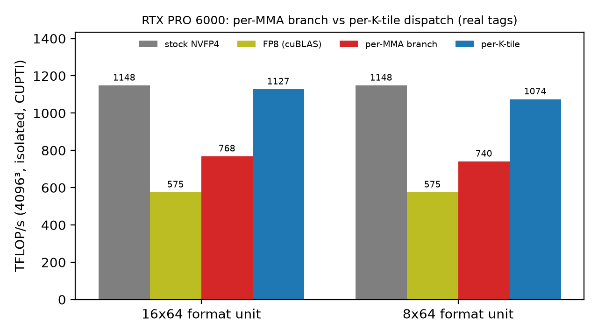

# K-tile dispatch ablation at 4096³ on the RTX PRO 6000 (kernel-opt amendment 20; the paper's Figure 2(a))

**Question.** What does one format dispatch per K-tile buy over choosing the format per MMA, on this GPU?

**Answer.** Choosing the format per MMA (an ordinary C++ if/else before every MMA, as in the historical kernel of
`sm120/kernel/docs/mixed_nvfp4_report.md` section 1) runs at **768 / 740 TFLOP/s** (16x64 / 8x64 units, real tags,
isolated launches), **+49.5 % / +55.1 % against stock NVFP4** (1148 TFLOP/s). The deployed per-K-tile kernels run at
**1127 / 1074 TFLOP/s, +1.8 % / +6.9 %**. Per-K-tile dispatch is **1.47x / 1.45x faster** than the per-MMA branch
(back-to-back: 1.58x / 1.57x). ptxas if-converts every per-MMA branch into a predicated OMMA pair, so the per-MMA
kernels issue **twice the tensor-pipe instructions** (static estimate 16,777,216 against 8,388,608 at 4096³).
cuBLAS FP8 through `torch._scaled_mm` reaches 575 TFLOP/s here; both mixed variants stay above it.

## Kernels and method

Protocol: `PROTOCOL.md` (registered 2026-10-09 12:42 UTC, `registration.json`, kernel-opt 4ec02b9).
- **stock_ko:** `build_V`'s stock set at 4096³ (`stock_wA_e64`, the adopted table's width and scheduler row).
- **FP8:** cuBLAS through `torch._scaled_mm` (e4m3, per-tensor FP32 scales, bf16 out). On this machine cuBLAS
  dispatches `sm89_xmma_gemm_e4m3bf16_e4m3f32_f32_tn_n_tilesize256x64x64_stage4_warpsize4x1x1_tensor16x8x32_execute_kernel__5x_cublas`
  (an sm89 XMMA kernel; torch 2.9.0+cu128). It is the standard path, not a tuned FP8 kernel for sm120.
- **Per-MMA branch (new, `build_KT`):** `n16k64_wA_e64_t0_permma` (16x64, weights on A) and `n8k64_wB_t0_permma` (8x64,
  weights on B). Each has its deployed counterpart's CTA tile, warp arrangement, placement, epilogue, k_tile body and
  scheduler setting; only the dispatch differs.
- **Per-K-tile:** `build_V`'s `mixed_ko` (`n16k64_wA_e64_t0`) and `mixed_wB_ko` (`n8k64_wB_t0`) at their deployed
  4096³ configurations.
- **Operands (C2U's):** weights N(0, 0.02) seed 4096, 4096 tokens N(0, 1) with per-token FourOverSix. Tags: `real` =
  layer 0 `o_proj` of the unit's Llama-3.1-8B TC map (4.44 % / 3.34 % E0M3 tiles); `e2m1` = every tile E2M1.
- **Timing (C2U / M1):** CUPTI kernel times. Isolated: per call a 512 MiB read-flush and the next weight copy of a
  rotation over >= 4x the L2 (58 copies; 33 for FP8), 3 warm-up + 30 timed calls per configuration and round.
  Back-to-back (b2b): 20 calls per block over the same rotating copies. 3 rounds in a rotated order; a round's value is
  the median of its calls, the reported value the median of the 3 rounds.
- **Run:** 2026-10-09 13:22 UTC on the idle GPU, with GSM8K M1 (paper-eval part M) paused (paper-eval amendment 15). No
  clock locking and no ncu (neither is available). Power limit 500 W (default 600 W), as in every earlier record; SM
  clock 2610–2647 MHz in every block, no power-cap time.
- **Deviation 1:** the first timing run stopped at the registered count check (isolated, round 0, FP8: 60 kernels
  profiled, 30 expected). Its FP8 filter also counted the read-flush's 0.3 µs `Memset`. Every configuration now counts
  only the GEMM kernel by name (`bench_gemm_isolated.classify`, as the NVFP4 configurations already did), and the run
  restarted from the beginning. The stopped run's partial record is `time_run1_stopped.json`.

## Results

Isolated (cold weights):

| kernel | µs | TFLOP/s | vs stock_ko | per round (µs) |
|---|---:|---:|---:|---|
| stock NVFP4 (stock_ko) | 119.74 | 1147.8 | — | 119.74 / 120.11 / 119.70 |
| FP8 (cuBLAS) | 239.13 | 574.7 | +99.7 % | 239.13 / 239.12 / 239.42 |
| 16x64 per-MMA branch, real tags | 179.01 | 767.8 | +49.5 % | 179.17 / 179.01 / 178.82 |
| 16x64 per-K-tile (build_V), real tags | 121.92 | 1127.3 | +1.8 % | 121.92 / 122.62 / 121.73 |
| 16x64 per-MMA branch, all-E2M1 | 178.97 | 767.9 | +49.5 % | 178.86 / 178.97 / 179.44 |
| 16x64 per-K-tile, all-E2M1 | 121.09 | 1135.0 | +1.1 % | 121.06 / 121.09 / 121.14 |
| 8x64 per-MMA branch, real tags | 185.73 | 740.0 | +55.1 % | 185.66 / 185.74 / 185.73 |
| 8x64 per-K-tile (build_V), real tags | 127.98 | 1073.9 | +6.9 % | 127.98 / 128.16 / 127.84 |
| 8x64 per-MMA branch, all-E2M1 | 185.97 | 739.0 | +55.3 % | 185.97 / 186.13 / 185.76 |
| 8x64 per-K-tile, all-E2M1 | 126.91 | 1083.0 | +6.0 % | 126.91 / 127.09 / 126.66 |

Back-to-back:

| kernel | µs | TFLOP/s | vs stock_ko |
|---|---:|---:|---:|
| stock NVFP4 (stock_ko) | 102.08 | 1346.4 | — |
| FP8 (cuBLAS) | 212.86 | 645.7 | +108.5 % |
| 16x64 per-MMA branch, real tags | 167.79 | 819.1 | +64.4 % |
| 16x64 per-K-tile, real tags | 105.89 | 1298.0 | +3.7 % |
| 8x64 per-MMA branch, real tags | 173.21 | 793.5 | +69.7 % |
| 8x64 per-K-tile, real tags | 110.17 | 1247.5 | +7.9 % |

(all-E2M1 rows and every per-round value: `REPORT_tables.md`, `ktile_ablation.json`.)

- **The per-MMA branch costs the same whatever the tags** (real and all-E2M1 within 0.2 %): both OMMAs of every pair
  are issued either way.
- **The rounds agree within 0.8 %** for every kernel in both modes (the widest: per-K-tile 16x64, real tags, isolated, 0.74 %).
- **The per-MMA branch is not 2x slower** even though it issues 2x the tensor instructions (+50 … +70 %, not +100 %):
  the stock kernel is not purely tensor-pipe bound at this shape and clock here (an inference from the timings; there
  are no counters to show where the time goes).

## Static SASS census (C2 style; static counts, not measured counters)

| kernel | build | instructions | OMMA | predicated OMMA | BRX | WARPSYNC | OMMA per steady k-iteration | tensor-pipe estimate at 4096³ |
|---|---|---:|---:|---:|---:|---:|---:|---:|
| stock_ko | stock_wA_e64 | 1528 | 64 | 0 | 0 | 3 | 32 | 8,388,608 |
| per-K-tile 16x64 | n16k64_wA_e64_t0 | 3984 | 1024 | 0 | 0 | 1 | 32 | 8,388,608 |
| per-MMA 16x64 | n16k64_wA_e64_t0_permma | 1816 | 128 | 128 | 0 | 133 | 64 | 16,777,216 |
| per-K-tile 8x64 | n8k64_wB_t0 | 4736 | 1024 | 0 | 0 | 51 | 32 | 8,388,608 |
| per-MMA 8x64 | n8k64_wB_t0_permma | 1904 | 128 | 128 | 0 | 134 | 64 | 16,777,216 |

- **The MMA count doubles.** ptxas turns every per-MMA if/else into `@P PRMT tag; @P OMMA (E0M3); @!P OMMA (E2M1)`, each
  OMMA wrapped in a predicated `WARPSYNC`. Every path through a steady k-iteration issues 64 OMMAs, against 32 for the
  per-K-tile and stock kernels. A predicated-off OMMA still takes a tensor-pipe issue slot, so the estimate doubles:
  16,777,216 against 8,388,608, equal to the historical ncu count of the per-MMA kernel on the RTX 5090.
- **The per-K-tile kernels hold 1024 OMMAs (16 specialized arms), all unpredicated**, and every path issues 32 per
  iteration.
- The estimate is OMMAs per iteration x 32 k-tiles x 8 MMA warps x 1024 output tiles. FP8 (cuBLAS) has no census.

## Checks

- **Correctness:** each per-MMA build's output equals its `build_V` per-K-tile kernel's bitwise at 4096³, for the real,
  all-E2M1, all-E0M3 and random 30 % tags in both units (`check.json`), and again on the timed operands (`time.json`).
- **The new code is inactive unless asked for:** `n16k64_wA_e64_t0`, `n8k64_wB_t0` and `stock_wA_e64`, rebuilt from the
  modified sources (`build_KT_ref`), have `build_V`'s SASS, patched and unpatched. The generator's default output equals
  `build_V`'s headers byte for byte. The per-MMA builds have the same SASS with and without their counterparts'
  dispatch defines (`build_KT_nodef`).
- **No other compute process** was on the GPU in any block.

## Files

- `REPORT.md` (this file), `REPORT_tables.md`;
- `ktile_ablation.json` (every cell), `time.json` (the run, per call), `time_run1_stopped.json` (deviation 1);
- `census.json`, `check.json`;
- `tflops.png` (the bar chart), `numbers.tex` (LaTeX macros: isolated, real tags);
- `PROTOCOL.md`, `registration.json`, `build_KT.sh`;
- script: `experiments/kernel_opt/ktile_ablation.py`.
- Builds: `/home/dev/n16k64_campaign/kernel_opt/build_KT{,_nodef,_ref}` (not in git).
