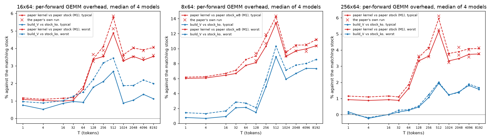

# SM120 kernels for the paper: the paper's kernels against the current ones (build_V)

This summary uses the committed NVFP4-RaZeR records only: nothing was measured for it, and no GPU was used.
- **Script:** `experiments/kernel_opt/paper_summary.py`.
- **Generated:** `tables.md` (every table, per T and per model), `summary.json` (all cells) and `overhead.png`.
- **The end-to-end re-measurement plan** is `E2E_PLAN.md`.

**Terms.**
- **The paper kernels:** the `sm120/build` sets behind every paper number, on the paper tile table: `mixed` for
  16x64 and 256x64 maps, `n8k64_wB` for 8x64 maps, and `stock` / `stock_wB` for FourOverSix.
- **The current kernels:** `build_V`, the deployment directory since 4ae044a (2026-10-03), on the tracked table
  `sm120/configs/<gpu>.ko.json`:
  - `mixed_ko` (16x64);
  - `mixed_wB_ko` (8x64);
  - `mixed256_ko` (256x64);
  - `stock_ko` (FourOverSix).
- **Method:** the paper's deviation 2 (M1). It times isolated launches with cold weights (CUPTI), median of 3 rotated
  rounds × 30.
  - The per-forward time is the sum over the quantized text Linears, with each map's `typical` tags (lower-median
    module) and `worst` tags (densest module).
  - Four models (Llama-3.1-8B, Mistral-7B-v0.3, Phi-4, Qwen3.8-27B) at T = 1 … 8192.
  - A value is the median over the models; "T ≥ 128" and "all T" are medians over the 28 and 48 (model, T) cells.

## 1. Headline

Per-forward GEMM overhead in %, typical tags, T ≥ 128 (the paper's range) / all T. Worst tags are in `tables.md` §0.

| unit | the paper: paper kernel vs paper stock | now: build_V vs stock_ko | the paper kernel vs stock_ko | build_V vs the paper kernel, absolute time |
|---|---:|---:|---:|---:|
| 16x64 | +3.55 % (paper run) / +3.15 % (M1) | **+1.46 % / +1.02 %** | +4.72 % / +3.86 % | **−2.85 % / −2.52 %** |
| 8x64 | +10.01 % vs stock_wB (paper run) / +8.68 % (M1) | **+6.26 % / +3.83 %** | +11.19 % / +36.09 % ‡ | **−4.50 % / −25.58 %** |
| 256x64 | +3.65 % (paper run) / +3.14 % (M1) | **+1.30 % / +0.68 %** | +4.86 % / +3.92 % ‡ | **−3.05 % / −2.55 %** |
| stock | — | — | stock_ko is −0.76 % / −0.64 % against the paper stock | |

‡ splice of two sessions (flag 3). The last column is a chain of paired links (flag 4).

- **16x64:** the overhead against the matching stock fell from +3.5 % to +1.5 % at T ≥ 128. Worst tags: +3.9 % to
  +2.2 %.
  - In absolute time the current kernel is 2.9 % faster than the paper's.
  - The stock got faster too: −0.8 % at T ≥ 128, −3.5 % at T = 256.
- **8x64:** against `stock_ko` the overhead fell from +11.2 % to +6.3 % at T ≥ 128, and from +75 % to +0.8 % at T ≤ 16.
  - The paper compared the 8x64 kernel with `stock_wB`, the same-placement stock: +10.0 %. `stock_wB` has no narrow
    tiles. At T ≤ 16 (M1; the paper run starts at T = 128) the paper kernel is +6 % against it but +75 % against the
    weights-on-A stock that FourOverSix deploys.
  - The narrow tiles (optimization 1) are −40 … −42 % at T ≤ 16. At T ≥ 2048 the gain is −2.8 … −3.0 %, from t0, #2's
    dispatch and the pipelined flags.
  - 8x64 is still +6.7 … +7.4 % at T ≥ 2048, mostly in its tiles rather than the dispatch (§5, §6).
- **256x64:** the overhead fell from +3.6 % to +1.3 % at T ≥ 128 (all T: +0.7 %). It is now the closest of the three
  units to stock, and nearly independent of the E0M3 share (§6).

Per T, typical tags (before: the paper run at T ≥ 128 and the M1 session below that, against the paper stock; after: build_V
against stock_ko):

| T | 16x64 before | 16x64 after | 8x64 before (vs stock_wB) | 8x64 before (vs stock_wA) | 8x64 after | 256x64 before | 256x64 after |
|---:|---:|---:|---:|---:|---:|---:|---:|
| 1 | +1.08 % | +0.75 % | +6.01 % | +74.84 % | +0.78 % | +0.93 % | +0.17 % |
| 4 | +1.02 % | +0.52 % | +6.07 % | +75.14 % | +0.67 % | +0.88 % | −0.23 % |
| 16 | +0.99 % | +0.86 % | +6.44 % | +70.50 % | +0.92 % | +0.92 % | +0.01 % |
| 32 | +1.04 % | +0.96 % | +6.67 % | +63.50 % | +2.09 % | +0.88 % | +0.16 % |
| 64 | +1.67 % | +0.92 % | +7.75 % | +52.66 % | +2.13 % | +1.62 % | +0.26 % |
| 128 | +3.25 % | +1.78 % | +8.39 % | +46.80 % | +1.47 % | +3.33 % | +0.47 % |
| 256 | +3.61 % | +2.11 % | +10.69 % | +35.13 % | +4.90 % | +3.59 % | +1.06 % |
| 512 | +5.11 % | +2.68 % | +13.41 % | +19.19 % | +8.90 % | +5.25 % | +1.94 % |
| 1024 | +3.37 % | +0.87 % | +9.02 % | +9.14 % | +5.90 % | +3.22 % | +1.22 % |
| 2048 | +3.52 % | +1.04 % | +9.67 % | +9.27 % | +6.67 % | +3.70 % | +1.41 % |
| 4096 | +3.43 % | +1.37 % | +9.62 % | +9.13 % | +7.35 % | +3.57 % | +1.81 % |
| 8192 | +3.60 % | +1.12 % | +10.35 % | +9.91 % | +7.33 % | +3.77 % | +1.57 % |

## 2. What each optimization did (paired A/B, one session each)

Every row below is a paired comparison inside one registered M1 session: after vs before, the same models, tags and
rounds. None is a cross-run comparison. Values are the median over the 48 (model, T) cells, typical / worst tags, with
the band where the change concentrates. Full band tables are in `tables.md` §4.

| unit | optimization | amendment | record (results commit) | typical / worst, all T | where it acts (typical) | adopted |
|---|---|---|---|---:|---|---|
| 16x64 | #2: frequency-aware dispatch | 2 | `opt2/ab2.json` (74dfce1) | −0.46 / −0.14 % | flat, −0.3 … −0.7 % | 74dfce1 |
| 16x64 | t0: the site-0 PRMT tags dropped, on #2's dispatch | 6/6b | `t0/abT.json` (fe21c52) | −0.27 / −0.21 % | T ≥ 256: −0.5 … −0.9 % | 038b448 |
| 16x64 | #4: 64×64 epilogue tile + tile-scheduler order | 5 | `4/ab4.json` (52b81c3) | −0.61 / −0.55 % | T ≥ 128: −0.6 … −1.5 % | 038b448 |
| 16x64 | 4b: the act-warm width re-tune | 4b | `retune/b/abR.json` (fefdba4) | −0.04 / −0.05 % | the changed cells: T = 256 −2.0 %, 1024 −0.8 % | 038b448 |
| 16x64 | the four above + scheduler rows, measured together | 9 | `cum/cum_gemm.json` (32b4335) | **−1.96 / −1.54 %** | T ≥ 128: −2.4 % | (the deployed path) |
| 16x64 | REDUX: uniform-branch dispatch on the wide tiles | 17 A | `U/U.json` (01fdfbc) | **−0.37 / −0.49 %** | T = 256 −1.6 %; T ≤ 64 ≈ 0 | 9c81422 |
| 8x64 | opt 1: narrow token tiles m16/m32/m64 | base protocol | `ab1.json` (540e1da) | **−13.08 / −13.39 %** | T ≤ 16 −41 %; T = 128 −28 %; T ≥ 1024 ≈ 0 | 540e1da |
| 8x64 | opt 1b: cooperative 128×64 tile | 1 | `ab1b.json` (56dc82d) | −0.01 / +0.01 % | T = 256 −14.6 %, T = 1024 −1.5 % | 56dc82d |
| 8x64 | t0 + #2's dispatch (P2 with P1) | 11 | `w8/p2/w8p2.json` (fb434c7) | **−1.25 / −0.38 %** | T ≥ 256: −2.0 … −3.1 % | 0c8dbcb |
| 8x64 | P3b: reduced width table + scheduler rows | 12b | `w8/p3b/w8p3b.json` (0c8dbcb) | −0.06 / −0.09 % | T = 128 −1.1 % | 0c8dbcb |
| 8x64 | pipelined flag reads | 17 A | `U/U.json` (01fdfbc) | −0.17 / −0.16 % | T = 256 … 512: −0.5 … −0.7 % | 9c81422 |
| 256x64 | A′: 4-arm kernel with 32-row granules | 3 | `A1/abA1.json` (95fa44f) | **−1.22 / −1.42 %** | flat, −0.6 … −1.8 % | 2b60b01 |
| 256x64 | amendment 18: REDUX + t0 + e64 builds, at A′'s widths | 18 | `V/V.json` (5c6e080) | −1.10 / −0.99 % | T ≥ 128: −1.0 … −2.4 % | 4ae044a |
| 256x64 | amendment 18: the re-tuned table (`table_v`) | 18 | `V/V.json` (5c6e080) | −0.16 / −0.22 % | T = 128 … 256: −1.7 … −2.7 % | 4ae044a |
| 256x64 | amendment 18 total (`mixed256_ko` vs A′) | 18 | `V/V.json` (5c6e080) | **−1.29 / −1.26 %** | T = 128 … 256: −2.9 … −4.4 % | 4ae044a |
| stock | #4 on stock | 5 | `4/ab4.json` (52b81c3) | −0.62 % | flat | 038b448 |
| stock | 4b widths on stock | 4b | `retune/b/abR.json` (fefdba4) | −0.07 % | T = 256 −2.8 % | 038b448 |
| stock | `stock_ko` vs the paper stock (#4 + 4b + rows) | 9 | `cum/cum_gemm.json` (32b4335) | −0.64 % | T = 256 −3.5 % | (the deployed stock) |

Measured but not on the current path (`tables.md` §4):
- t0 with the default dispatch (16x64 −0.42 %; 8x64 −0.76 %): the adopted form is t0 with #2's dispatch.
- #2's dispatch alone on the 1b set (8x64 −0.70 %): it was adopted together with t0 in amendment 11.
- #2's dispatch on the 16-arm kernel for 256x64 maps (−0.56 %): superseded by A′.
- t0 on A′ (+0.01 %; not adopted in amendment 7) and the 4b widths on A′ (−0.04 %; A′ kept the paper table): both
  were superseded by amendment 18.

The adopted M1 sessions (UTC): opt 1 2026-09-30 10:41–10:52; opt 1b 09-30 14:21–14:34; #2 09-30 17:53–18:43;
A′ 09-30 19:24–19:49; 4b 09-30 22:23–22:55; #4 10-01 00:09–00:57; t0 10-01 03:17–04:18; amendment 9 10-01 05:55–09:13;
amendment 10 10-01 13:16–13:30; amendment 11 10-02 15:36–16:10; amendment 12b 10-02 17:27–17:43; amendment 17
10-03 08:11–08:49; amendment 18 10-03 11:16–11:58. The paper's own deviation-2 run was 09-30 06:23–06:36.

## 3. From the paper kernel to build_V, by chains of paired links

A chain multiplies the paired ratios of consecutive steps. Each link's "before" is the previous link's "after": the
same builds and table rows, measured in a later session.

| unit | links | T ≥ 128 | all T | T ≤ 16 | T ≥ 2048 |
|---|---|---:|---:|---:|---:|
| 16x64 | amendment 9 (paper set → `build_7freq` `mixed_ko`) × amendment 17 (→ `build_U`) | −2.85 % | −2.52 % | −0.7 … −0.9 % | −2.7 … −3.0 % |
| 8x64 | opt 1 × opt 1b × amendment 11 × 12b × 17 | −4.50 % | −25.58 % | −40.5 … −42.2 % | −2.8 … −3.0 % |
| 256x64 | amendment 3 (paper set → A′) × amendment 18 (→ `mixed256_ko`) | −3.05 % | −2.55 % | −1.2 … −1.3 % | −2.8 … −2.9 % |
| stock | amendment 9 (paper stock → `stock_ko`) | −0.76 % | −0.64 % | −0.0 … −0.1 % | −0.6 … −1.0 % |

- **The same-session check.** C3v (amendment 19; 2026-10-03 16:17–16:26) ran the adopted paths and the paper kernels
  in one session, on its own grid: 3 shapes × T ∈ {1, 16, 128, 512, 2048, 8192}. Adopted vs paper, in absolute time:
  - 16x64: −2.9 % at f = 0 and −3.1 % on the real maps (chain −2.5 %);
  - 8x64: −5.3 % and −5.0 %. These are medians of 18 cells, half of them at T ≤ 128, where the paper kernel has no
    narrow tiles (down to −52 %);
  - 256x64: −6.1 % and −5.9 %. Its paper reference differs from the paper's set (flag 6), so it does not check the chain.

## 4. The paper kernels against stock_ko

| | T ≥ 128 | all T | basis |
|---|---:|---:|---|
| 16x64, typical / worst | +4.72 / +5.30 % | +3.86 / +4.12 % | one session (amendment 9) |
| 8x64, typical / worst | +11.19 / +11.88 % | +36.09 / +36.86 % | **splice** (opt-1 session × amendment 9) |
| 256x64, typical / worst | +4.86 / +5.25 % | +3.92 / +4.21 % | **splice** (#2 session × amendment 9) |

So, against the same `stock_ko`, the gap closed by these amounts at T ≥ 128 (typical):
- 16x64: +4.7 % → +1.5 %;
- 8x64: +11.2 % → +6.3 %;
- 256x64: +4.9 % → +1.3 %.

## 5. 4096³ decompositions (b2b / isolated / sustained, %; `tables.md` §6)

Each block comes from one session. The real map is Llama-3.1-8B layer 0 o_proj of the unit's map.
- **tiles:** the kernel's no-dispatch ceiling with t0 (no PRMT tags) vs the stock.
- **tags:** the tagged ceiling vs the t0 ceiling.
- **dispatch:** all-E2M1 tags vs the kernel's own ceiling.
- **E0M3 tiles:** the real map vs all-E2M1.

**16x64** (before: the paper set vs the paper stock_wA, C2‴ in the t0 session; after: `mixed_ko` from build_V vs
`stock_ko`, C2U):

| part | before | after |
|---|---|---|
| tiles (t0 ceiling vs stock) | +0.05 / −1.00 / +0.02 | +0.19 / +0.20 / +0.05 |
| site-0 tags | +0.83 / +1.73 / +1.04 | 0 (t0) |
| dispatch | +2.15 / +1.76 / +2.92 | +1.08 / +0.84 / +1.45 |
| E0M3 tiles, real map | +0.60 / +0.51 / −1.09 | +0.51 / +0.86 / −1.41 |
| **total, real map vs stock** | **+3.67 / +3.02 / +2.88** | **+1.78 / +1.91 / +0.07** |
| all-E0M3 vs all-E2M1 | +4.61 / +5.08 / +2.77 | +4.49 / +5.15 / +3.63 |

- The tags and half the dispatch are gone. The tiles were never the problem.
- REDUX alone, against the path just before it in the same session: dispatch +1.57 → +1.08 % (b2b) and total
  +2.45 → +1.78 %.
- All-E0M3 tags still cost +3.6 … +5.2 %. Real maps hold 2–4 % E0M3 tiles (C3v).

**8x64** (before: the paper `n8k64_wB`, C2w (amendment 10) vs `stock_ko`; after: `mixed_wB_ko` from build_V, C2U):

| part | before | after |
|---|---|---|
| tiles (t0 ceiling vs stock_ko) | +4.18 / +4.14 / +3.38 | +4.59 / +3.99 / +5.77 |
| — of which placement + #4 (stock_wB vs stock_ko) | +0.81 / +1.24 / +1.06 | (not split in C2U) |
| — of which the 1x8 arrangement (t0 ceiling vs stock_wB) | +3.34 / +2.86 / +2.29 | (not split in C2U) |
| site-0 tags | +1.22 / +1.11 / +1.32 | 0 (t0) |
| dispatch | +3.90 / +3.80 / +4.35 | +2.13 / +1.79 / +1.37 |
| E0M3 tiles, real map | +0.79 / +0.51 / +1.14 | +1.01 / +1.27 / +1.33 |
| **total, real map vs stock_ko** | **+10.42 / +9.85 / +10.55** | **+7.90 / +7.19 / +8.66** |
| all-E0M3 vs all-E2M1 | +2.01 / +1.80 / +2.62 | +6.43 / +7.41 / +6.76 |

- t0 removed the tags (−1.2 points) and #2's dispatch roughly halved the dispatch cost.
- The tiles are unchanged, at +4 … +6 %: the weights-on-B 1x8 arrangement with 1.5× the shared-memory reads. They
  are now the larger part, and no bitwise-safe lever is known (`w8/REPORT.md`, `w8/CLOSING.md`).
- #2's dispatch puts the all-E2M1 pattern first, so all-E0M3 tags cost more than before (+2.0 → +6.4 %). Real maps hold
  about 2 % E0M3 tiles.

**256x64** (compact; `tables.md` §6). Total, real map vs the stock:
- the paper set: +3.79 / +3.20 / +3.27 % (C2″, against the paper stock_wA);
- A′: +2.35 / +1.70 / +1.81 % (C2″);
- `mixed256_ko`: +1.59 / +1.10 / +1.26 % against `stock_ko` (C2V; tiles +0.33 / −0.25 / +0.15).
- All-E0M3 costs A′ and `mixed256_ko` at most 1.5 % (+0.34 / +0.22 / +1.47 %), against +4.3 … +5.2 % for the paper
  set.

## 6. E0M3 share (C3v, amendment 19; `tables.md` §7)

Overhead against `stock_ko`, mean of 3 shapes, random placement, at f = 0 / the real map / f = 100 %:

| T | 16x64 | 8x64 | 256x64 |
|---:|---|---|---|
| 1 | +1.0 / +1.5 / +2.5 % | +2.0 / +2.6 / +5.4 % | +0.4 / +0.6 / +0.5 % |
| 16 | +0.7 / +1.3 / +2.4 % | +2.1 / +2.8 / +5.8 % | +0.5 / +0.8 / +0.6 % |
| 128 | +2.8 / +3.5 / +5.1 % | +1.9 / +2.4 / +5.1 % | +0.8 / +1.3 / +0.7 % |
| 512 | +1.1 / +2.1 / +10.5 % | +8.6 / +10.2 / +20.5 % | +1.7 / +2.1 / +1.8 % |
| 2048 | +2.2 / +2.7 / +7.2 % | +8.9 / +9.3 / +15.8 % | +1.2 / +1.5 / +2.5 % |
| 8192 | +0.9 / +1.1 / +5.9 % | +7.1 / +7.6 / +14.4 % | +1.6 / +1.6 / +1.4 % |

- **E0M3 share of the real maps** (Llama-3.1-8B, the typical module per projection, mean of 3): 16x64 2.8 %, 8x64 2.1 %,
  256x64 8.0 %. Per projection the shares are 2.1–3.8 %, 1.6–2.9 % and 6.1–10.8 %.
- **Slope per 100 % E0M3** (least squares, random placement):

  | unit | T ≤ 16 | T = 128 | T ≥ 512 |
  |---|---|---|---|
  | 256x64 | −0.1 … +0.5 | +0.1 … +0.4 | −0.2 … +1.6 |
  | 16x64 | +0.4 … +3.5 | +0.7 … +3.7 | +5.1 … +14.2 |
  | 8x64 | +2.2 … +6.3 | +0.8 … +5.3 | +5.4 … +16.7 |

- **Placement:** contiguous E0M3 placement costs 16x64 and 8x64 +13 … +31 % in the single-wave cells at T = 512,
  against −0.5 … +13.6 % random. 256x64 is insensitive to placement (≤ 4 points).
- **The real maps lie on the random curves:** within −1.9 … +1.3 points.

## 7. Bases that differ (flags; nothing is spliced silently)

1. **The reference stock changed.** The paper's overheads are against the paper stock (`sm120/build`, paper table);
   the current ones are against `stock_ko`, which is itself 0.6 % faster (−3.5 % at T = 256).
   - So "+3.5 % → +1.5 %" (16x64) mixes the kernel's gain with the stock's.
   - §4 and the chains in §3 put both on one footing.
2. **8x64's reference changed meaning.** The paper's same-placement reference was `stock_wB`, which has no narrow tiles
   (+64 % against `stock_ko` at small T). The current 8x64 overhead is against `stock_ko`, the stock FourOverSix
   deploys (amendment 10).
   - `stock_wB_ko` (the tuned weights-on-B stock) exists but is not a FourOverSix deployment path.
   - Quote the 8x64 paper number against the paper's `stock_wA` (its main table has both) when comparing.
3. **Splices:** the paper 8x64 and 256x64 kernels against `stock_ko` (§4). No session measured those paper kernels
   with `stock_ko`.
   - Each splice multiplies the kernel's overhead against the paper stock in its own session by the stock shift
     measured in amendment 9.
4. **Chains:** up to five sessions (8x64). Each link is paired, and each link's "before" is the previous link's
   "after" (same builds and table rows).
   - The product assumes a ratio transfers across sessions. C3v's cross-session check of identical builds found
     medians of +0.1 … +0.4 %, and single cells up to 4 %.
5. **T < 128 has no paper-run value.** The paper's deviation-2 run covers T ≥ 128. Below that, "before" comes from
   the kernel-opt M1 sessions, which use the same method.
   - At T ≥ 128 those sessions match the paper run at the median within 0.1 points: 16x64 +3.47 vs +3.55 %; 8x64
     +9.92 vs +10.01 %; 256x64 +3.63 vs +3.65 %.
6. **C3v's 256x64 "paper kernel" is one 128-wide `n16k64_wA` build**, not the paper's `mixed` set. Its −47 % extreme is
   a small-T width effect.
   - Use the M1 chain (§3) for 256x64.
   - C3v's 16x64 paper kernel is the paper set `mixed`, as in the paper. Its 8x64 paper kernel is `n8k64_wB`, which is
     the paper's.
7. **4096³ references:**
   - 16x64 before is against the paper `stock_wA` (C2‴); after is against `stock_ko` (C2U). At 4096³, `stock_ko` is
     0.9 / 1.6 / 0.4 % faster (C2w).
   - 8x64 uses `stock_ko` on both sides.
   - Each block is one module of one map. The sustained mode sits at the 500 W cap (SM clock 1.6–2.1 GHz), which
     explains its noisier entries, e.g. negative E0M3 costs.
8. **The re-tune record.** `retune/abR.json` is amendment 4, which was not adopted (its tuner measured cold
   activations). The adopted 4b is `retune/b/abR.json`, and that is the one used here.
9. **Tags.** Every session uses the paper run's artifacts with the same per-projection `typical` / `worst` tags, so
   the maps are the paper maps throughout.

## 8. A fresh paired GEMM run: needed only for absolute same-session tables (proposed, not run)

The overheads in §1 need no new run: before and after are each measured against their own stock in one session.
A fresh run is needed only if the paper wants either of these:
- one table with the paper and current kernels' absolute µs per forward from a single session, for example to state
  "build_V is X % faster than the paper kernels" for 8x64 and 256x64 without a chain or splice;
- the "GEMM vs end-to-end consistency" table regenerated together with the end-to-end re-run (`E2E_PLAN.md`).

**The minimal paired run (one M1 session, the paper's tags, 4 models × 12 T):**
- **Paper builds** (`sm120/build`, paper table):
  - `stock_wA`, `stock_wB`;
  - `mixed` on the 16x64 maps and on the 256x64 maps, typical and worst;
  - `n8k64_wB`, typical and worst.
- **build_V** (tracked ko table):
  - `stock_ko`;
  - `mixed_ko`, `mixed_wB_ko` and `mixed256_ko`, typical and worst;
  - optionally `stock_wB_ko`.
- **Checks:** 15 (16) configurations in one rotated order, with the bitwise check of every paper/current pair per
  call.
- **Optionally,** one 4096³ C2 block with both sides' ceilings.
- **Estimate:** about 1–1.5 h of one idle GPU, gates included.
  - For scale: the paper's 9-configuration run took 13 min at 7 T, and amendment 17's 11-configuration session took
    38 min including its gates and C2.
- **Registration:** a protocol amendment with the builds' manifests and the table's sha256, as for amendments 17–19.
