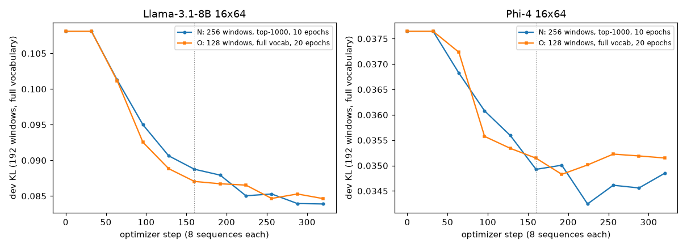

# Development-set KL during calibration (Llama-3.1-8B and Phi-4, 16x64)

The release maps were calibrated with `--no-dev`, so their only progress signal was the per-epoch training KL. That is
the top-1000 KL on the 256 fit windows, which keep changing, and at epoch 5 it was still falling. This note measures the
held-out quantity: the full-vocabulary KL of the hard map against the BF16 model on 192 development windows, along the
calibration.

## Setup

- **Trainer:** the vendored `calibration/tmopt/run_train_map.py` of flipquant 120173a (main = optimized-defaults), run
  directly. The command is the one `calibration.train_map` builds (`train_map.command`), with `--no-dev` dropped so
  the trainer's own development evaluation runs (monitor only). `--no-eval` stays. Commands: `experiments/release_maps/devkl_run.py`.
- **N, the release setting:** `--fit-windows 256 --teacher-topk 1000`, lr 0.02, init −1, seed 0, 8 sequences per step,
  32 steps per epoch.
  - It runs for **10 epochs instead of the release's 5**. The schedule is constant, so epochs 1–5 are the release run
    and epochs 6–10 show whether 5 epochs stopped early.
  - `--eval-every 1`.
- **O, the paper setting:** 128 windows, the full-vocabulary teacher, 20 epochs of 16 steps, `--eval-every 2`. The
  evaluations fall at the same steps as N's: 0, 32, …, 320.
- **Development set:** 192 windows of 512 tokens per model, three draws of 64. All 192 are distinct documents, none of
  them among the 128 paper fit documents or the 128 extension documents (also checked by window token hash;
  `dev_kl.json` → `disjointness`).
  - Llama-3.1-8B: the paper's three development sets (confirmation, gate_up_confirm, tile_refine_confirm). The release
    data root holds only their manifests, enough for the extension rule. The windows come from the paper's data root
    (`cost_comparison/data`); its manifests are byte-identical to the vendored ones, and `fresh.pt` matches its
    recorded sha256. The calibration record is the release root's.
  - Phi-4: fresh_dev1–3 of the release data root.
- **Metric:** the trainer's development evaluation in its TM-OPT configuration (`dev_backend native`). It is the mean
  over windows of the per-token KL(BF16 teacher ‖ model with the current hard map). The teacher's full-vocabulary
  log-probabilities are kept on the host in BF16. The model runs on the native b8x64 kernel (realquant
  `libb8x64.so`, NVFP4-RaZeR `repro_local/realquant/build`) with per-document FourOverSix activation scales (that
  evaluator's convention).
  - Step 0 is the FourOverSix start, before any flip. One evaluation takes 12.3 s (Llama) or 14.1 s (Phi-4).
- **Monitor only, checked:** the development evaluation never touches training.
  - N's `map_epoch005.pt` is the release map: the tiles are equal and every tensor record is byte-identical. The
    file sha256 differs only through `torch.save`'s archive name, `map_epoch005/` against `map/`.
  - O's final `map.pt` is the paper map (Llama `54070819…`, Phi-4 `110243a6…`, the same file sha256).

## Results

Development KL (192 windows, full vocabulary), training KL as logged, E0M3 tiles; aligned by optimizer step.
N's training KL is the top-1000 + tail-bucket KL on 256 windows; O's is the full KL on 128 windows.

### Llama-3.1-8B 16x64

| step | N epoch | N dev KL | N train KL | N E0M3 | O epoch | O dev KL | O train KL | O E0M3 |
|---:|---:|---:|---:|---:|---:|---:|---:|---:|
| 0 | 0 | 0.10811 | — | 0 | 0 | 0.10811 | — | 0 |
| 32 | 1 | 0.10811 | 0.10106 | 0 | 2 | 0.10811 | 0.09695 | 0 |
| 64 | 2 | 0.10127 | 0.09955 | 712 | 4 | 0.10117 | 0.09278 | 1,157 |
| 96 | 3 | 0.09500 | 0.09302 | 3,531 | 6 | 0.09254 | 0.08228 | 13,400 |
| 128 | 4 | 0.09064 | 0.08636 | 14,037 | 8 | 0.08884 | 0.06903 | 46,127 |
| **160** | **5 (release)** | **0.08876** | 0.07883 | 32,125 | 10 | 0.08705 | 0.05986 | 79,006 |
| 192 | 6 | 0.08793 | 0.07135 | 56,133 | 12 | 0.08672 | 0.05423 | 108,060 |
| 224 | 7 | 0.08504 | 0.06398 | 81,550 | 14 | 0.08653 | 0.05020 | 134,091 |
| 256 | 8 | 0.08528 | 0.05925 | 108,393 | 16 | 0.08466 | 0.04659 | 157,770 |
| 288 | 9 | 0.08394 | 0.05518 | 131,596 | 18 | 0.08529 | 0.04432 | 179,966 |
| **320** | **10** | **0.08389** | 0.05207 | 157,497 | **20 (paper)** | **0.08464** | 0.04239 | 201,648 |

### Phi-4 16x64

| step | N epoch | N dev KL | N train KL | N E0M3 | O epoch | O dev KL | O train KL | O E0M3 |
|---:|---:|---:|---:|---:|---:|---:|---:|---:|
| 0 | 0 | 0.03765 | — | 0 | 0 | 0.03765 | — | 0 |
| 32 | 1 | 0.03765 | 0.03567 | 0 | 2 | 0.03765 | 0.03670 | 0 |
| 64 | 2 | 0.03683 | 0.03581 | 142 | 4 | 0.03724 | 0.03649 | 399 |
| 96 | 3 | 0.03608 | 0.03517 | 5,261 | 6 | 0.03558 | 0.03285 | 34,263 |
| 128 | 4 | 0.03559 | 0.03232 | 33,031 | 8 | 0.03534 | 0.02839 | 99,420 |
| **160** | **5 (release)** | **0.03493** | 0.02933 | 79,591 | 10 | 0.03515 | 0.02558 | 135,406 |
| 192 | 6 | 0.03501 | 0.02715 | 120,133 | 12 | 0.03483 | 0.02404 | 163,948 |
| 224 | 7 | 0.03424 | 0.02577 | 155,869 | 14 | 0.03501 | 0.02283 | 201,607 |
| 256 | 8 | 0.03461 | 0.02460 | 191,039 | 16 | 0.03523 | 0.02196 | 228,888 |
| 288 | 9 | 0.03456 | 0.02361 | 219,086 | 18 | 0.03519 | 0.02145 | 259,308 |
| **320** | **10** | **0.03485** | 0.02267 | 251,621 | **20 (paper)** | **0.03515** | 0.02026 | 287,062 |

### Paired comparisons (per window, mean ± 2 SE over the 192 windows; `*` = |Δ| > 2 SE; `paired.json`)

| | Llama-3.1-8B | Phi-4 |
|---|---:|---:|
| release map (N epoch 5) − paper map (O end) | **+0.00412 ± 0.00184 \*** | −0.00022 ± 0.00058 |
| N epoch 10 − paper map | −0.00075 ± 0.00178 | −0.00030 ± 0.00047 |
| N epoch 10 − N epoch 5 | **−0.00487 ± 0.00189 \*** | −0.00008 ± 0.00064 |
| release map − start (FourOverSix) | −0.01935 ± 0.00395 \* | −0.00272 ± 0.00083 \* |
| paper map − start | −0.02347 ± 0.00460 \* | −0.00250 ± 0.00095 \* |
| N epoch 10 − N's lowest point | 0 (lowest at step 320) | +0.00061 ± 0.00066 (lowest at step 224) |
| O end − O's lowest point | 0 (lowest at step 320) | +0.00032 ± 0.00075 (lowest at step 192) |

## Findings

1. **Llama-3.1-8B: 5 epochs stop early.**
   - The release map's development KL is 0.00412 ± 0.00184 nats/token worse than the paper map's.
   - Five more epochs at the release setting remove the whole gap: N at epoch 10 equals the paper map within noise,
     −0.00075 ± 0.00178.
   - Both runs are still at their lowest point at step 320.
2. **Phi-4: no lasting change after step 160.**
   - N dips significantly at epoch 7 (step 224 − step 160: −0.00068 ± 0.00047) and comes back. N at epoch 10 equals N
     at epoch 5 (−0.00008 ± 0.00064).
   - The release map, the paper map and N at epoch 10 are equal within noise.
   - The rises after the lowest points (step 224 for N, 192 for O) are within 2 SE, so they are not overfitting.
   - Llama's paper setting, by contrast, still gains from step 160 to 320 (−0.00241 ± 0.00172).
3. **Development KL tracks the training KL only early.**
   - Up to about step 128 both fall together.
   - After that the training KL keeps falling steeply while the development KL flattens:
     - Llama N, steps 160→320: training −34 %, development −5.5 %;
     - Phi-4 N: training −23 %, development flat.
   - The training KL keeps improving on a fit set the map increasingly specializes to. Held-out KL rises nowhere
     significantly.
4. **At equal steps, the new setting flips fewer tiles.**
   - Llama at step 160: 32,125 against 79,006; Phi-4: 79,591 against 135,406.
   - It reaches a similar development KL only later on Llama, and on Phi-4 the extra flips buy nothing held-out.
   - A possible reason, not tested here: the top-1000 teacher, and a gradient spread over twice the windows per epoch.

**Caveats.**
- The development windows are math/code text, the fit set's domain. WikiText-2 and C4 PPL measure other text, so
  the two need not agree. For Phi-4 the release map's 16x64 PPL is slightly behind the paper map's (6.6325 / 10.5157
  against 6.6133 / 10.5047) while their development KLs are equal.
- The evaluator uses per-document activation scales, while the PPL convention is per token.
- One seed, one unit (16x64), two models.

## Cost

| run | trainer total | setup | epochs × mean time | dev evaluations | GPU peak allocated | host ru_maxrss |
|---|---:|---:|---:|---:|---:|---:|
| Llama N | 10.6 min | 97 s | 10 × 40.2 s | 10 × 12.3 s (+ initial 13.0 s, final 12.1 s) | 41.9 GiB | 26.5 GiB |
| Llama O | 11.3 min | 83 s | 20 × 23.0 s | 10 × 12.3 s (+ initial 13.0 s, final 12.2 s) | 40.6 GiB | 41.8 GiB |
| Phi-4 N | 17.6 min | 147 s | 10 × 75.2 s | 10 × 14.2 s (+ initial 15.7 s, final 14.1 s) | 60.2 GiB | 28.2 GiB |
| Phi-4 O | 18.0 min | 128 s | 20 × 39.9 s | 10 × 14.2 s (+ initial 15.9 s, final 14.2 s) | 59.4 GiB | 33.2 GiB |

The development teacher costs one BF16 forward over 192 windows at setup, plus host memory for its
log-probabilities: 192 × 511 × the vocabulary × 2 bytes, 25 GB for Llama and 20 GB for Phi-4.
