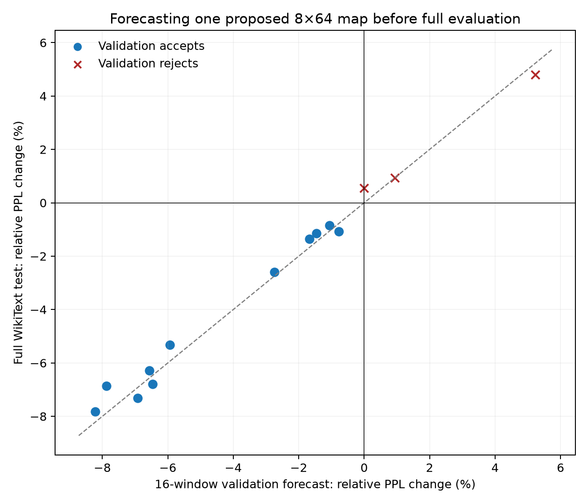
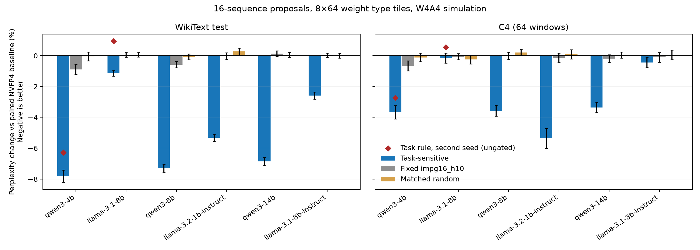

# Task-sensitive MixFP4 at 8x64: measured results

**8x64 supports substantial gains, but the 16-sequence proposal needs independent validation.**
A second Llama calibration seed regresses; its validation check predicts that regression
before full evaluation. The calibration command can reject such a map and export NVFP4 instead.

Finite-step calibration on fitting data corrects both subsequent 64-sequence Llama failures:
the same acceptance rule chooses different step sizes and improves WikiText and C4 on both seeds.
The tables below retain every failed fixed-budget proposal and separate the follow-up evidence.

One frozen calibration rule: 16 training sequences, identity-STE final-NLL gradients,
mean + 2 SE < 0 eligibility, and a total predicted reduction budget of 0.1 nats/token.
Weights use 8x64 type tiles, 1x16 scale blocks, alpha=1 on both grids.
Activations use nvfp4_4over6. These are W4A4 prefill evaluations at sequence length 2048,
with use_cache=False for all rows. No reordering or scale search is used.

The first two models are development models; the remaining four test the unchanged rule.
All rows have contemporaneous paired baselines. Historical absolute perplexities are
not substituted for these baselines. C4 uses a fixed 64-window subset.

| Model | Tiles switched | WikiText baseline | WikiText delta | C4 baseline | C4 delta |
|---|---:|---:|---:|---:|---:|
| qwen3-4b | 50 | 13.8960 | -1.0860 | 14.4370 | -0.5288 |
| llama-3.1-8b-local | 6,387 | 6.8972 | -0.0792 | 8.4706 | -0.0133 |
| qwen3-8b | 291 | 10.0352 | -0.7336 | 11.5481 | -0.4126 |
| llama-3.2-1b-ins-local | 501 | 15.4133 | -0.8206 | 18.2185 | -0.9758 |
| qwen3-14b | 462 | 8.9103 | -0.6114 | 10.5090 | -0.3529 |
| llama-3.1-8b-ins-local | 2,543 | 7.8466 | -0.2031 | 9.6854 | -0.0422 |

## Controls

Perplexity deltas against the same baseline, WikiText / C4.

| Model | Frozen task rule | Fixed impg16_h10 | hess_h1.5 | Matched random |
|---|---:|---:|---:|---:|
| qwen3-4b | -1.0860 / -0.5288 | -0.1241 / -0.0957 | +0.5779 / +0.0370 | -0.0062 / -0.0165 |
| llama-3.1-8b-local | -0.0792 / -0.0133 | +0.0039 / -0.0050 | -0.0378 / -0.0489 | +0.0044 / -0.0210 |
| qwen3-8b | -0.7336 / -0.4126 | -0.0585 / -0.0012 | -0.0139 / +0.0516 | -0.0075 / +0.0234 |
| llama-3.2-1b-ins-local | -0.8206 / -0.9758 | -0.0047 / -0.0245 | +0.0569 / -0.1265 | +0.0420 / +0.0162 |
| qwen3-14b | -0.6114 / -0.3529 | +0.0117 / -0.0201 | -0.0204 / -0.0600 | +0.0056 / +0.0041 |
| llama-3.1-8b-ins-local | -0.2031 / -0.0422 | +0.0022 / -0.0105 | -0.0525 / -0.0479 | +0.0000 / +0.0062 |

## Forecast before full evaluation

A single check of the selected map against baseline on 16 separate calibration windows
estimates its NLL change. The relative perplexity forecast is exp(delta NLL) - 1.
This evaluates one chosen map, not a sweep of configurations. It forecasts WikiText
relative change; it does not assume that the same shift holds on C4.

| Model | Calibration forecast (%) | Actual WikiText change (%) | Calibration NLL SE |
|---|---:|---:|---:|
| qwen3-4b | -8.22 | -7.82 | 0.00587 |
| llama-3.1-8b-local | -1.46 | -1.15 | 0.00300 |
| qwen3-8b | -6.92 | -7.31 | 0.00398 |
| llama-3.2-1b-ins-local | -5.94 | -5.32 | 0.00464 |
| qwen3-14b | -7.88 | -6.86 | 0.00540 |
| llama-3.1-8b-ins-local | -2.74 | -2.59 | 0.00360 |

## Independent calibration seed

Same rule and final evaluation text, seed 20260907 instead of 20260906.

| Model | First seed WikiText / C4 | Second seed WikiText / C4 | Second-seed tiles |
|---|---:|---:|---:|
| qwen3-4b | -1.0860 / -0.5288 | -0.8721 / -0.3931 | 31 |
| llama-3.1-8b-local | -0.0792 / -0.0133 | +0.0646 / +0.0464 | 8,548 |

## More calibration, unchanged rule

Llama-3.1-8B uses 64 fit sequences, retaining each original 16-sequence prefix
and exactly the same validation/probe windows. The score rule and 0.1 budget stay fixed.

| Seed | Tiles | Validation delta NLL | Validation supports improvement? | WikiText delta | C4 delta |
|---|---:|---:|---|---:|---:|
| 20260906 | 7,997 | -0.000118 | no | +0.0377 | +0.0338 |
| 20260907 | 9,504 | +0.050990 | no | +0.3309 | +0.1583 |

## Calibrating the finite step on fitting data

Exploratory Llama follow-up, reusing each 64-sequence score set. Starting at 0.1,
halve the predicted-reduction budget until actual fit improvement reaches 25% of
prediction and fit mean + 2 SE is negative; at most eight attempts, then NVFP4.
The chosen proposal receives one separate validation check. Validation/test loss
does not choose the step size. These are development follow-ups, not untouched-model tests.

| Seed | Fit attempts | Accepted budget | Tiles | Validation delta NLL | Validation supports improvement? | WikiText delta | C4 delta |
|---|---:|---:|---:|---:|---|---:|---:|
| 20260906 | 2 | 0.050000 | 2,163 | -0.016838 | yes | -0.0932 | -0.0327 |
| 20260907 | 3 | 0.025000 | 647 | -0.007759 | yes | -0.0736 | -0.0292 |

## Third calibration seed, frozen finite-step procedure

Seed 20260908, fresh 64-sequence scores, with the identical backtracking constants.
These runs were declared before inspecting the preceding backtracking validation/test results.
They test calibration-seed stability on the development models; the test text is reused.

| Model | Fit attempts | Accepted budget | Tiles | Validation delta NLL | Validation supports improvement? | WikiText delta | C4 delta |
|---|---:|---:|---:|---:|---|---:|---:|
| qwen3-4b | 1 | 0.100000 | 36 | -0.066798 | yes | -0.9432 | -0.4417 |
| llama-3.1-8b-local | 2 | 0.050000 | 2,334 | -0.010670 | yes | -0.0589 | +0.0045 |

## Calibration command verification

* qwen3-4b, seed 20260907: `accepted`, 31 exported tiles; proposal matches the research map exactly.
* llama-3.1-8b-local, seed 20260907: `fallback_nvfp4`, 0 exported tiles; proposal matches the research map exactly.

## Validation gate across reported proposal runs

The fixed check accepts 11 of 14 proposals. 0 accepted proposals have a positive WikiText PPL delta in this record.
On C4, one accepted proposal has a positive PPL point estimate; 0 have paired delta NLL minus 2 SE above zero. Calibration targets WikiText, so cross-domain behavior needs a separate check.
The mean absolute error of the validation forecast is 0.38 percentage points of relative WikiText PPL change, including rejected proposals.
This is a descriptive check over related models, repeated test text, and development
follow-ups. It is not a bound on unseen-model failure probability. In particular,
rejection means insufficient support on the calibration distribution, not proof
that a map is harmful everywhere.

All proposals, including failures, are tabulated in [proposal_summary.csv](proposal_summary.csv).

## Calibration cost

One H100 per model. Gradient-collection time excludes model/data loading and final evaluation.
The first pair use their fresh-score replication timings; initial final-test runs reused scores.

| Model | Gradient collection (seconds) | Peak allocated GPU memory (GiB, whole job) |
|---|---:|---:|
| qwen3-4b | 48.1 | 23.0 |
| llama-3.1-8b-local | 82.5 | 30.8 |
| qwen3-8b | 81.9 | 33.5 |
| llama-3.2-1b-ins-local | 11.9 | 8.8 |
| qwen3-14b | 152.6 | 52.5 |
| llama-3.1-8b-ins-local | 79.6 | 30.8 |

For the fresh 64-sequence confirmation runs:

| Model | Gradient collection (seconds) | Fit proposals evaluated |
|---|---:|---:|
| qwen3-4b | 188.2 | 1 |
| llama-3.1-8b-local | 281.4 | 2 |

Each fit proposal costs 64 forwards, plus one 64-window fit baseline.
Independent validation costs 16 forwards for the map and 16 for baseline.
The research runs additionally repeat fit evaluation and run full benchmark tests.

## Cache-path check

The repeated maps are also checked on their same validation windows with caching enabled.
Primary final-test measurements above keep caching disabled.

| Model | Cache-off validation delta NLL | Cache-on validation delta NLL |
|---|---:|---:|
| qwen3-4b | -0.067885 | -0.064851 |
| llama-3.1-8b-local | +0.009356 | +0.012455 |

## Scope and limitations

* This predicts promising finite interventions, not exact final perplexity. The 0.1 budget is a heuristic, not a bound on actual loss.
* Confidence margins are sequence-level stability checks, not simultaneous statistical guarantees over millions of tiles.
* First-order scores cannot safely be summed over arbitrary numbers of switches: the initial broad policies failed.
* WikiText and C4 evaluation windows may share documents; NLL standard errors are descriptive.
* This is fake-quantization accuracy evidence on H100, not a benchmark of an E0M3 hardware kernel.
* Token-by-token decoding and other evaluation domains are not established by these prefill results.
* Six models from two families and limited calibration-seed repeats do not establish universal behavior.

Whiskers transform paired NLL mean ± 1.96 SE; they are descriptive, not formal guarantees.

See [PROTOCOL.md](PROTOCOL.md), [summary.csv](summary.csv), and [anatomy.json](anatomy.json).
